# Acknowledgement

1.Smart is a term that functions as an empty signifier. It is susceptible to many interpretations. Similar terms interpreted from its use could be: intelligent, knowledgeable, creative, virtual, inter-connected and digital, among others.

2.This thesis is concerned with what “smart" indicates in infrastructure and technological innovation, rather than smart governance or e-government.

3.I use the term DIY (Do-It-Yourself) as in using alternative methods and not standardized by industry. I use DIT (Do-It-Together) and DIWO (Do-It-With-Others) as of when this non standardized methods of doing things are made in a group of people.

4.My intended form of this thesis  was in an HTML2PRINT work flow. For the sake of respecting the delay this version was design in InDesign but the coming Web Site and personal version will be made with Paged.Js.

Thanks to my supervisor [**Lysianne Lechot-Hirt**](https://www.hesge.ch/head/annuaire/lysianne-lechot-hirt) for her patience and always goodwill to guide me when in doubt.

Thanks to [**Andrea Sick**](https://andreasick.de/) and [**Frieder Nake**](https://en.wikipedia.org/wiki/Frieder_Nake) who guide through the process in Bremen.

Thanks to [**Civic City**](http://civic-city.org/) for giving me many of the concepts that I elaborate.

Thanks to [**Genevieve Costello**](https://genevievecostello.net/) for proofreading the thesis.

Thank you all of those who have made an effort to listen to my ideas and develop them through discussions.

# Introduction
This text provides an overview and comparative analysis of select contemporary methods used in smart urbanism in physical spaces. It aims to contribute a critical understanding of best practices in contemporary urbanism and public space.

By drawing on interviews with practitioners, including artists, designers, architects, and software developers; and by conducting the comparative analysis of three cases, this research provides new and sometimes opposing perspectives on the issue of smart urbanism. The diverse methods that are examined are broad and I will try to establish a typology.

Issues of decision making for public space can be divided into bottom-up and top-down planning. Bottom-up planning prioritises the hyper-local and top-down planning prioritises a master plan that is commonly developed from an institutional point of view.

The interviewees and the case studies are situated in between these two planning methodologies. Hopefully, this way of proceeding will show how these two types of urbanisms are not exclusive to each other. In working together, they may be able to create a better dialogue for the process of place making in public space and lighten the number of points to be discussed in this process.

The rise of many of DIY and guerrilla urbanism practices can be attributed to the lack of involvement of inhabitants and users of public spaces in their co-creation. As well, the lack of legal structures that facilitate temporary intervention or activities in public spaces has contributed to the rise of DIY and guerrilla urbanism.

The three case studies were chosen to better understand positive practices for participatory methods for conceptualising, designing and implementing the cases' proposals. Two examples come from Western European cities and one is based in Russia, but with outcomes that are global. Despite many efforts of diverse local or national authorities for establishing participative processes in urban decisions, there does not seem to exist a rule of thumb for creating an open hybrid channel - that is, one that is both digital and physical - for civic discussion about the future issues of the city. This essay intends to be the basis for a developing hypothesis on how a hybrid public space could exist.

Drawing from texts by Richard Sennett and other thinkers dealing with the concepts of the Public Sphere and the commons, I share freely this research, its references and documentation in depth on a dedicated website to be published in January 2019: https:/juangomez.co/hybridpublicspaces.

This thesis aims to help users of public space understand the digital infrastructural narratives presented by many private and institutional stakeholders, as well as citizen and independent initiatives for the use and co-creation of public space.

# What is smart city urbanism?
>  "Technology is the answer, but what was the question?”
Cedric Price

The term “smart city” is a narrative used to explain many of technical advancements that a city can add to its infrastructure to make it work more efficiently and improve the life of its inhabitants. In conjunction with state and architecture firms, big technology companies such as Cisco and Siemens in the 90s developed the narrative of the smart city to show a prospective vision of what its urban space might look like. Songdo in South Korea, Masdar City in the United Arab Emirates and a curious settlement PlanIT Valley in Portugal are the only examples of this narrative that have been constructed[^1]. In the language of these companies, “smart urbanism” stands for the use of an enormous amount of data to improve the living quality and performance of infrastructure in a city. It also stands for a knowledge economy within a city-region where the idea of a smart citizen is encouraged by innovation, creativity and entrepreneurship.

[^1]:Greenfield, Adam. Against the Smart City, Amazon Media, 2013.

A city is in constant construction and in search of understanding itself better to create a harmonious living condition for its inhabitants; or, at least that’s what its stakeholders, planners and inhabitants aim to do[^2]. In this sense, the city-as-project has long and short term temporal frames that help the narrative of its growth be more manageable.

[^2]:Referring to the city as having hopes, intentions I mean the assemblages of the stakeholders in the city planning and history. Is the overall will of all the people involved is is use and conception.

The companies and architects that initiated the endeavor of prototyping the canonical smart cities have also been dealing with infrastructural issues of emergent and established cities. By creating smart cities in an absolute top-down demo fashion, the resilient aspect of these demo cities must be put into question. This examination is necessary as the cities are made from a proposed ideal way of living that is inspired by techno-solutionism, which prioritizes data over wisdom[^3][^4]. For the developers and urbanists of these cities, historicity starts when the next version of the city emerges from data extraction. This second version thrives for optimization, rather than from its inhabitants' own standardised way of living or their common past.

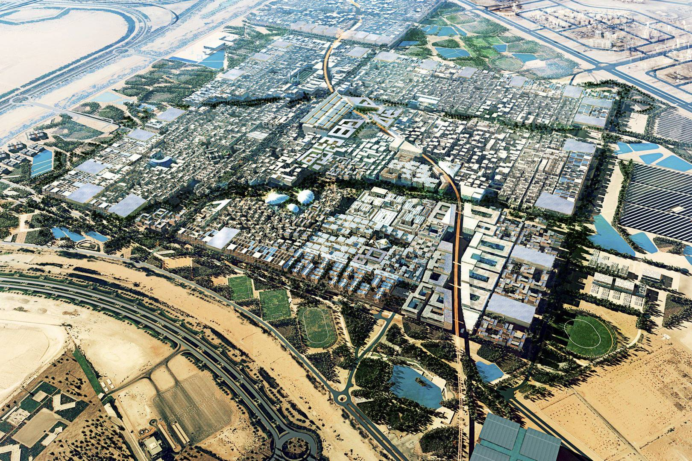
*An aerial view of proposed Masdar City (Eastern Orientation) being developed in Abu Dhabi. UAE, Image courtesy Masdar.*

[^3]:(DIKW): Data<Information<Knowledge<Wisdom

[^4]:**Halpern, Orit. “Hopeful Resilience.” The Truth of Art - Journal # 71 March 2016 - e-Flux, 2016**
“That is, every present state of the smart city is understood as a demo or prototype of a future smart city; every operation is understood in terms or testing and updating. As a conse- quence, there is never a finished product,
but rather infinitely replicable, yet always preliminary versions of these cities around the globe.”

A common narrative as definition of the smart city in which optimization and efficiency are key for improving the quality of life of its citizens is as follows:

> A smart city is an urban area that uses different types of electronic data collection sensors to supply information which is used to manage assets and resources efficiently. This includes data collected from citizens, devices, and assets that are processed and analyzed to monitor and manage traffic and transportation systems, power plants, water supply networks, waste management, law enforcement, information systems, schools, libraries, hospitals, and other community services. The smart city concept integrates information and communication technology (ICT), and various physical devices connected to the network (the Internet of things or IoT) to optimize the efficiency of city operations and services and connect to citizens. Smart city technology allows city officials to interact directly with both community and city infrastructure and to monitor what is happening in the town and how the city is evolving.[^5][^6]

Transformed by decisions of urbanists and politicians and historical conflicts such as wars and revolutions, the collective projects of cities have been developing for more than 5,000 years. Why disregard their mistakes and how they have overcome their problems? In this sense, the work of Chantal Mouffe is relevant. Mouffe's work shows how friction and conflict may be an initiator of and potential for new city dynamics and encounters that create proactive ideas[^7]. Even though she is not directly involved with urban theory, Mouffe's view on social change involves a plurality of social actors. Mouffe proposes that the increase of social complexity leads to two antagonistic camps. The camp that wants social change should create a new narrative to unite with other social groups for their cause[^8]. Thus, social change may be achieved through the mobilisation of people by antagonism.

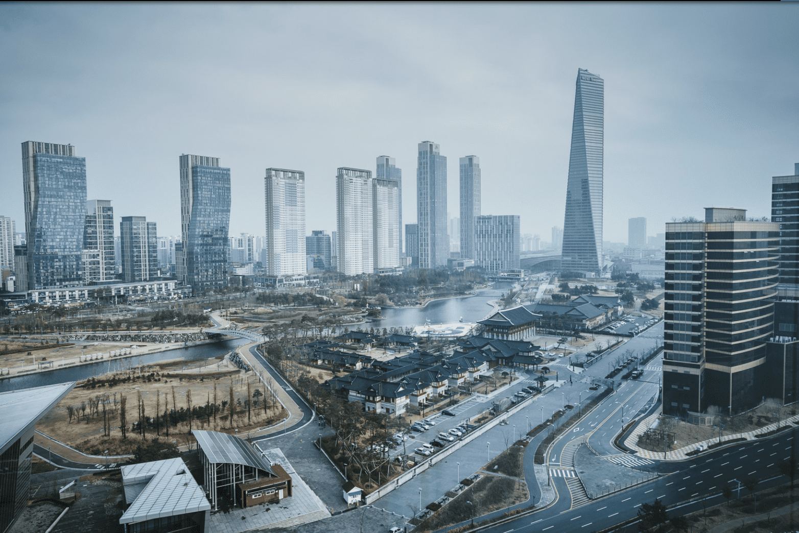
*New Sondo, Korea © Jun Michael Park*

*Tahrir Square, Cairo (Cryptome Protest Photos Series)*

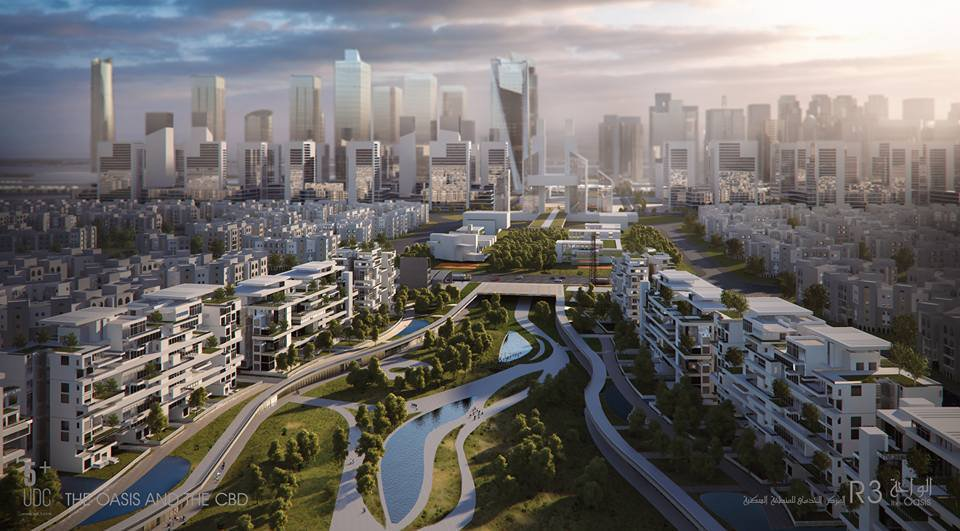
*Rendering of the new administrative capital of Egypt, a planned city 45 kilometers east of Cairo. [Urban Development Consortium]*
 

[^5]:In all of the top-down smart cities I investigate, Top down urban planners create narratives so that their intentions and actions are well-structured when they are implemented. This is done so that the public opinion on the subject can follow a coherent path on progress for mankind. Top-down urban planners use progress as a synonym of optimization and, therefore, a better quality of living for the city inhabitants.

[^6]:**Smart City. (n.d.). In Wikipedia.** Retrieved September 20, 2018

[^7]:Mouffe, Chantal. **“Chantal Mouffe: Agonistic Democracy and Radical Politics.” Pavilion Journal.**

[^8]: Laclau, Ernesto, and Chantal Mouffe. 1992. **“Hegemony and socialist strategy: towards a radical democratic politics”**. London: Verso.

[^9]:Lindsey, and Ursula. **“The Anti-Cairo.”** Places Journal, Princeton University Press, 1 Mar. 2017

Paradoxically, governments or power structure sometimes use the tabula rasa method in order to reinforce political status quo. A recent example of this is when the Egyptian regime authorities attempted to make people forget some of the most important protests in the Arab Spring by moving historical sites of public space protests to the outskirts of the city[^9].

Investment in smart cities can be associated with the increasing densities of Western cities and the increasing intricacies of their social fabric. The governing institutions of the cities that go forward with using technological enhancements want to be seen as role models in problem solving the overcrowded future. For example, see the Prime Minister of Canada presenting Toronto’s Waterfront collaboration with Google SideWalk Lab[^10]. Thus, it becomes a race for the best standardised solution of a city in a box[^11]. As such, developers of these cities expect to recreate this procedure at a fast pace[^12]. Some of the premises used by these companies to enter people's imaginaries either for making them want to live in this cities or to make them believe that their technological methods are the best range from:

[^10]:Prime Minister of Canada, **“Prime Minister Trudeau Delivers Remarks on the Future of Toronto’s Waterfront.”**

[^11]:Volume 34.**“City in a Box”**, Archis, January 2013

[^12]:Peters, Adele.[**“Inside Songdo, The City Designed From Scratch To Be Sustainable.”**](https://www.fastcompany.com/3064402/inside-songdo-the-city-designed-from-scratch-to-be-sustainable) Fast Company, Fast Company, 1 Aug. 2018

>“…using this technology to empower people living in the buildings to make good decisions”[^13]

to

>“new technology can help, but people can’t afford to wait for digital advances to transform the urban environment”[^14]

[^13]:Peters, Adele.[**“Inside Songdo, The City Designed From Scratch To Be Sustainable.”**](https://www.fastcompany.com/3064402/inside-songdo-the-city-designed-from-scratch-to-be-sustainable) Fast Company, Fast Company, 1 Aug. 2018

[^14]: [SideWalk Labs](https://sidewalklabs.com/)

However, as Antoine Picon testified from visiting Songdo several times, very few people live there because of the high rent prices. And, those that do live there do not know each other because the urban activities do not allow for serendipitous encounters. Thus, not many people have yet shown interest in starting a new life in these cities[^15]. As well, these technologically-grandiose city projects might not be suitable for European cities, as they are part of an old continent full of history. For example, in 2014 the European Union published a document on smart cities that noted, “European cities prefer to reinvent by building on the existing spatial, social, political and economic systems that constitute their identities”[^16].

[^15]:Picon, Antoine.**“Un futur sans humains (3/4),De la Smart City à la surveillance généralisée: quand le numérique envahit la rue”**, (Podcast France Culture)

[^16]:“Mapping Smart Cities in the EU.” , European Parliament , 15 Jan. 2014

This narrative can be described as a “closed system” using of Richard Sennett’s concept. Sennett thinks that many of the current development of cities is “ever more rigid, crude, and closed[^17]” and does not allow for the possibility to fail and to learn from failure. This is because in the economics of a closed system, failure is not an option.There a logic of producing a result rather than taking on a problem.

[^17]:Sennett, Richard. **“The Open City”** ,Harvard School of Design Talks, 17 Oct. 2017

Opposed to these canonical smart cities prototypes, there also exists a response from cities to tackle the issues of overpopulation cited above with a “consequential drive to retrofit networked information technologies into existing urban places[^18]” as Adam Greenfield states. Some examples of this range from the embedding of sensors within the traffic network to the use of handheld devices to photograph and notify the city of problems that need to be solved. Regarding this other view of the smart city, the embedding of sensors is also done for the sake of another narrative that is taking place right now known as the “green city” or “sustainable city,” in which sensors and equipment are installed to deal with issues of global warming. This can be controversial as research in recent years has shown that technological tools such as cloud computing produce as much CO2 as the airplanes in the USA[^19]. In a broader sense, these types of products and services are also bought by the municipalities to solve issues of the city and may make their work easier. There is no involvement of the citizens in the implementation of these products, which thus forces citizens to enter into a commodified ecosystem of “urban plugins.”

[^18]:Greenfield, Adam. Against the Smart City Amazon Media, 2013. Chapter 0

[^19]:Matamoros, Cristina **“Meet the Artist Raising Awareness about Google’s Carbon Footprint”** Euronews, May 8

*Prime minister of Canada presenting Toronto’s waterfront collaboration with Google SideWalks Lab*

The public perception of infrastructure has not always been as discrete[^20] as it is today from the side of urbanists and big tech companies. In the techno-euphoria of the late 19th century and early 20th century, urban infrastructure was publicly celebrated as evidence of the progress and benefits coming from modern political and economic governance[^21]. Nowadays, the overall idea of adding technological enhancement to infrastructure is something to look for but there are some deprecating aspects of these implementations that show only with years of use. Since many of these technological enhancements are linked to a market logic, they will eventually need to update or be revised from a technical side. Deprecation is then expected to happen, as technology changes fast and the current trend in architecture is not be resilient for changes[^22].

*The project CO2GLE shows a counter clocking up an estimate of the amount of CO2 emitted with each Google visit. Artwork by Joana Moll*

[^20]:Infrastructural improvements are generally show to the public once achieved through by images  but their technical side is not expanded to the public but only to competetnt authorities.

[^21]:**"Mediatising the Urban Landscape”**, Christoph Merian Verlag, 2013.“The public enthusiasm that municipal sewer systems inspired in the late 19th century is difficult to imagine today:’ The ‘electrical sublime’, the elusive beauty electric illumination, embodied in the public streetlight of the ‘Great White Ways’, was a main draw for pedestrian crowds in the early 20th century.”

Users of these systems adapt rapidly to their use as the current HIC (Human Computer Interaction) period is at a point of a “natural smooth interface[^23]” The citizen/user becomes genuinely part of the mechanism. As a result, they lose most of their agency and a black-boxing, in the sense developed by actor-network theory, takes place[^24]. I call this a process of banalisation of infrastructural changes. This process is controversial as many of the solutions that are put in motion are then forgotten by the users[^25].

[^22]:Mattern, and Shannon. **“Maintenance and Care: Fixing a Broken World.”** Places Journal, Princeton University Press, 1 Nov. 2018.&nbsp;
“Many manufacturers aim to keep their wares out of repair and remix economies, and they carefully control the evolutionary lifecycle of their products. That’s especially true for smartphones and laptops, which “live and die by the update,” as Wendy Chun says. 62 But code increasingly plays a critical role in the functioning of responsive architectures and networked cities. Maintaining buildings and public infrastructures now involves attending to their underlying software. In so-called smart cities, that’s going to get expensive."*

[^23]:Aiwen, Yin. **“Urbanizing the Digital: Call for Action”** Article, Volume #53

[^24]:Latour, Bruno. **“Reassembling the Social: an Introduction to Actor-Network-Theory”**, Oxford University Press, 2009

[^25]:Woyke, Elizabeth. “A Smarter Smart City.” MIT Technology Review, 23 Feb. 2018

As Saskia Sassen articulates, there is a tendency to “make these technologies invisible, and hence put them in command rather than in dialogue with users.[^26]”

[^26]:Nova, Nicolas, and Saskia Sassen. **“An Interview with Saskia Sassen about ‘Smart Cities'”** Pasta and Vinegar.

# Hybrid public space

The idea of the global village by Marshall McLuhan is a good starting point to investigate hybrid public space. McLuhan describes:

> “ The medium, or process, of our time electronic technology is reshaping and restructuring patterns of social interdependence and every aspect of our personal lives. It is forcing us to reconsider and re-evaluate practically every thought, every action, and every institution formerly taken for granted. Everything is changing - you, your family, your neighborhood, your education, your job, your government, your relation to ‘the others’. And they are changing dramatically ”[^27]

[^27]:McLuhan, Marshall, and Quentin Fiore. 
**“The Medium Is the Massage”**. Random House, 1967

The local plaza or public square of a city is interconnected with other public spaces of the world. This space doesn’t necessarily need to be physical. We can see it today on public internet forums. These are places where people not linked by geographical distance meet virtually to discuss or gather to express themselves.

There's an interdependent connection between the different notions of public space and public sphere. For Jürgen Habermas, the success of the public sphere was founded on rational critical discourse. By this, Habermas means a debate where “everyone is an equal participant and excellent communication skill is the power of argument.[^28]” Such an idealized proposal for public sphere indicates that the media by which public debate takes place are important. As such, there is a lot of contemporary critique to his notion of public sphere, where digital channels are not in fact egalitarian[^29]. As well, the current state of media channels has evolved since Habermas’ developed this notion, founded on media such as newspapers of the 60s. Since his notion of the public sphere is based on discourses, it is sometimes criticized as “aspatial.[^30]” In “The Fall of Public Man,” Richard Sennett develops a notion of the public sphere where the public realm is “a place where strangers can come together.[^31]”, Sennett advocates also for less fixity in the public realm, which is understood as a constantly evolving process.

[^28]:Soules, Marshall. **“Jürge Habermas and the Public Sphere.”** Dr. Marshall Soules, Malaspina University-College, 2007,
”Behind Habermas’ analysis lies an oral bias: he believes the Public Sphere can be most effectively constituted and maintained through dialogue, acts of speech, through debate and discussion."

[^29]:Kellner, Douglas.**”Habermas, the Public Sphere, and Democracy: A Critical Intervention”**, Accessed November 4, 2018

[^30]:Chandler, Curry **“Public Space, the Public Sphere, and the Urban as Public Realm”** *“Habermas’ study of the bourgeois Public Sphere is not only an account of specific historical phenomena, it also represents a normative ideal for rational-critical debate and deliberative politics. As such, Habermas’ theory has been interpreted as distinctly aspatial, not concerned with physical spaces but rather only an abstract discursive space”*

[^31]:Sennett, Richard. **“The Fall of the Public Man”**. Penguin, 2002.

Concerning this thought on the public sphere by Sennett, I found that spatial planning can be considered through his thoughts and concepts. The public sphere for Sennett also takes shape through what he calls “Theatrum Mundi,” a theatre that is a place of performance for strangers. This theatre helps create new narratives that allow for playfulness and subtle identity shifts in the conception of temporal spaces.
The metaphor of the theatre was also used by McLuhan when he started replacing the term “Global Village” with “Global Theater:

> “…the institution of a new kind of global theatre, in which all men become actors, and there are few spectators. The population of the world is both the cast and content of this new theatre. The repertory of the theatre consists of a perpetual happening, which can include the retrieval or replay of any previous happenings that men choose to experience.”[^32]

 [^32]:McLuhan, Marshall, and Barrington Nevitt. **“Take Today: The Executive as Dropout”**, Longman, 1972.

McLuhan anticipated a networked participatory society, and one cannot help but find similarities with today’s current state of social media platforms where people create and consume content in an infinite loop. Social media platforms are not only used for sharing content and opinions, but have also served as initial meeting points of communities around the world to gather in physical public spaces. Digitally-formed communities meet in physical spaces to share common interests via face-to face communication. Social media platforms have also been crucial for many of the political gatherings in public space and movements in recent years, such as the Arab Spring and Occupy Wall Street[^33].

[^33]:Ratto, Matt, and Megan Boler. **"DIY Citizensh**IP:**  Critical Making and Social Media"**, The MIT Press, 2014. 
“And increasingly, the DIY ethos has seismically reshaped the international political sphere, as can be seen in ongoing global uprisings and the uses of media and communications within a “logic of connective action”, a kind of “collective” or “networked” individualism constituting new hybrid social movements and practices of horizontal, participatory, and direct democracy. The Occupy Wall Street movement that began in September 2011—inspired by Los Indignados Movement in Spain, following the “Arab Spring”—represents just one example of such emergent, DIY political activities.”

*Reddit is the most visited digital forum with 1.66 billions visits per month (www.statista.com)*

This hybrid public space, composed of digital forums interconnected with physical spaces, is exemplified by the gathering and organizing of people on social media that then extends onto face-to-face exchange. The dynamics of gathering is crucial for civic action to take place. The discussions inside of these spaces generates value through exchange. Considered as civic space, though, it is extremely difficult for the prosumer to express any agency or power in order to contest or question these systems because the new most used digital public spaces are privately owned by proprietary software companies, such as Facebook and Twitter.
Proprietary channels of exchange also give value to other interests - private and not clearly defined ones. Expressing disagreement with the proprietary channels would add value to their interests, but the channels don't really know how, apart from acting within the market logic of creating content and ads. These companies are not obligated to explain their feedback loops or how they impact encounters in these spaces. The definition of user, as such, could be seen as “prosumer,” as they produce as much as they consume the space.

*Claude-Nicolas Ledoux, Oeil Reflétant l’Intérieur du Théâtre de Besançon, 1784. Courtesy Bibliothèque Nationale de France*

The improved quality of life and quality of the discussions produced in this participatory realm are difficult to measure. In order to create an open discourse around it, one must understand the inner structures of power that exist within the virtual walls. The over-commodification of physical spaces as well as the proprietary code in social networks make it difficult to create unbiased opinions about civic subjects, such as public infrastructure. As exposed above, public infrastructure is mainly created by companies with market-based agendas. Indeed, the many initiators of digital public spaces, such as Facebook and Google, have been recently accused of misusing anonymous data[^34], indicating the risk entailed if such companies serve as the governing powers of public space[^35]. Thus, it is crucial to address the question of civic use of data in hybrid spaces.

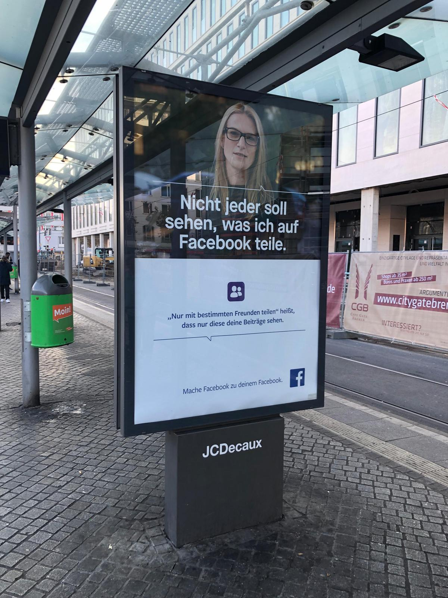
*After the numerous scandals on FaceBook privacy issues, the company launched a campaign in physical public space to invite their users to understand their policies on data and privacy, Bremen 2018 (Juan Gomez)*

[^34]:Bean, Randy.**“How Big Data Became ‘Big Bad Data.’”** Forbes, Forbes Magazine, 25 Apr. 2018.

[^35]:Fussell, Sidney. **“The City of the Future Is a Data-Collection Machine.”** The Atlantic, Atlantic Media Company, 21 Nov. 2018.

[^36]:**“On the Commons.”** www.onthecommons.org/.“The commons is a new way to express a very old idea—that some forms of wealth belong to all of us, and that these community resources must be actively protected and managed for the good of all.The commons are the things that we inherit and create jointly, and that will (hopefully) last for generations to come. The commons consists of gifts of nature such as air, oceans and wildlife as well as shared social creations such as libraries, public spaces, scientific research and creative works.”

*Dymaxion map is a hybrid representation of the world*

Which stakeholder gets a better opportunity to be critical when participating or designing these hybrid public spaces? Is it the user or the stakeholder who monetises its use? Under what conditions can there be a civic use of data?

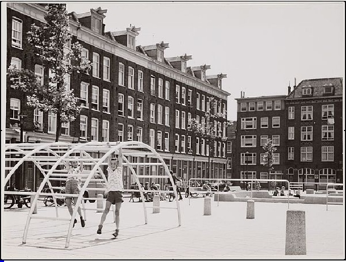
*“Aldo van Eyck built many playgrounds in the city anticipating play as a provocation against authoritharian regimes”  Merijn Oudennampsen*

The potential for hybrid spaces is perceived with ambivalence. They are often felt as a threat, in their potential for social control, video surveillance. But, they also are opportunities for different forms of participation, experience and social use of technologies in the physical public space. Physical and digital environments and spaces are crucial for the communication, cooperation and archiving of collective intelligence that materialises in the commons[^36]. This creates a resource that is maintained and expanded by a particular community, the benefits of which can be enjoyed by anyone who is a part of this community. What are today’s necessary conditions for transforming public spaces into the “common’s factory” for empowerment?

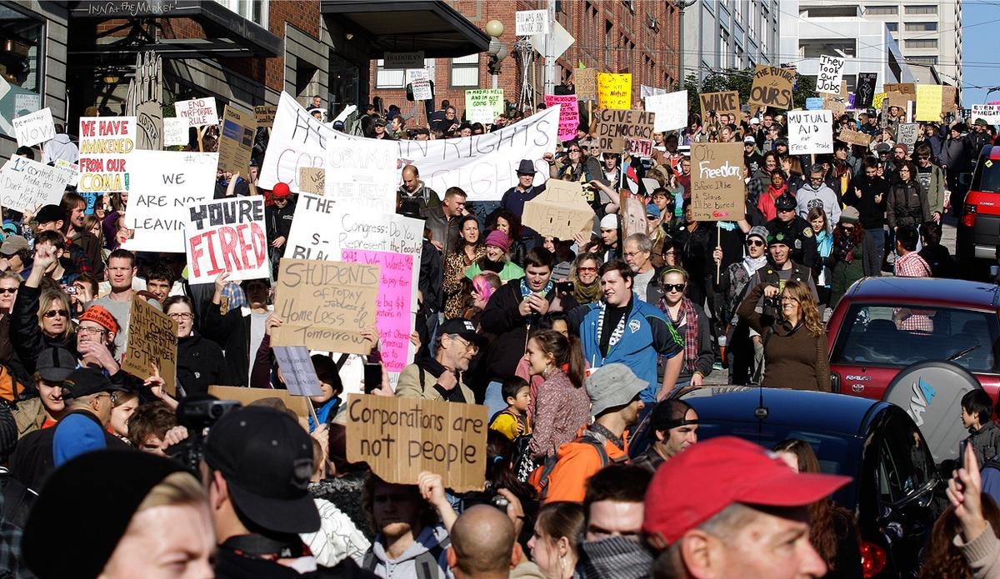
*Protesters with the “Occupy Seattle” movement march, Saturday, October 15, 2011, near the Pike Place Market in downtown Seattle. (AP Photo/Ted S. Warren)*

# A discourse for Hybrid Public Spaces

Top-down and non-participatory smart urbanism promotes the narratives it uses via Hackathons and consultations, which create an echo chamber from their ideas of technolutionism and “data solutionism.[^37]” Hybrid public spaces could be the counter-narrative tactical move to create another narrative, one created with the “unheard”, from Jacques Ranciere’s perspective[^38] [^39]. By this, Ranciere means those who have something to say about the issue of infrastructure. Saul Alinsky said in his book **“Rules for Radicals”** that “power speech needs an audience to be effective.” By not going to this organized empowerment created by them new ways to develop narratives on the smart cities could flourish.[^40]

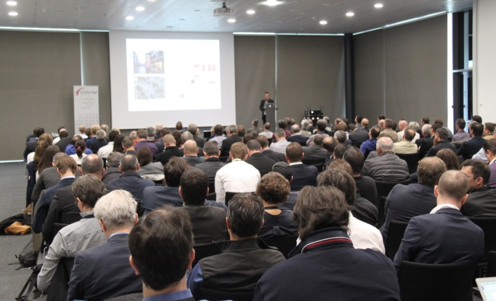
*Smart city Hackathon in Geneva, april 2018, Juan Gomez*

[^37]:Mattern, Shannon. **“Public In/Formation”** Places Journal, November 15, 2016.“Big data has taken over countless domains of public life — a troubling trend when social technocrats were in charge, and now, with the rise of Trumpism, an alarming one.” 

[^38]:Rancière, Jacques, et al. **“The Politics of Aesthetics: the Distribution of the Sensible”**, Bloomsbury, 2013.“A delimitation of spaces and times, of the visible and the invisible, of speech and noise, that simultaneously determines the place and the stakes of politics as a form of experience. Politics revolves around what is seen and what can be said about it, around who has the ability to see and the talent to speak, around the properties of spaces and the possibilities of time. “

[^39]:Birchall, Clare. **”Shareveillance: The Dangers of Openly Sharing and Covertly Collecting Data, Distribution of the (Digital) Sensible”** Manifold Scholarship.
“ Aesthetics for Rancière is a distributive regime determining what action, reaction, and thought are possible in any given situation. It is political precisely because, in every “distribution of the sensible,” equality is either undermined or affirmed as what is common and what is exclusive becomes apparent. A distribution determines “those who have a part in the community of citizens” ; it “reveals who can have a share in what is common to the community based on what they do and on the time and space in which this activity is performed” (8, emphasis added). Equality is enacted or verified when those without part, the unrepresented, come to take part, when those without a share have a share.”

[^40]:Alinsky, Saul David. **“Rules for Radicals: a Practical Primer for Realistic Radicals”**. Random House, 1972.

Public space near Stratumseind in Eindhoven includes one of the longest pub streets in The Netherlands. It has sparked collaborations between Philips, TU Eindhoven, Institute of Mental Health Care Eindhoven and Eindhoven municipality in which they experiment with light, smell and sound manipulations to " reduce tension and aggression" of the users of this space. For regular users, these experiments are not something of which they are aware. Even though they were aware, I think that they would not likely have enough knowledge on highly advanced subjects such as human behavior and environmental triggers that would properly equip them to act with agency. Citing the “black-box theory” again," the users will then be used to the new technologies without noticing them." What if the implementation of these experiments was also co-created with users?

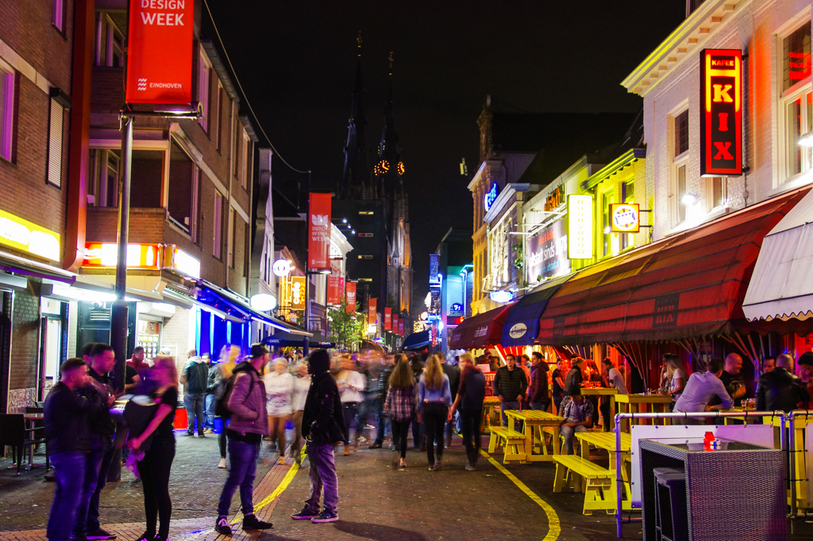
*Stratumseind, Einhoven (SmartDataCity)*

The writer Marc Schulenburg conceptualises the smart city in three layers[^41]:

1. The technology embedded in the city ( sensors, connectivity, RFID, big data, etc.).
   
2. The human dimension where people are “smart” and conscious of how urban fabrics are created as well as an understanding the stakes of the technologies in layer one.
   
3. “Smart governance,” what he defines as “the assembling of public and private parties into a hybrid identity, a new framework, in which the involvement and responsibility of the participating parties are reinvented and reformulated.”

[^41]:Schuilenburg, Marc, and George Hall. “ The Securitization of Society: Crime, Risk, and Social Order ”. New York University Press, 2018.

If we see the public space as a facilitator of agency, then this space could exist as a place for people to understand what is at stake in the infrastructure of public spaces around the world. As well, it could help people understand how global and local elements are shaping their entourage. City fabric changes slowly yet technology changes rapidly. This space could serve as an ephemeral mediation space in which artistic interventions takes place. Tactical and agile activities that symbolically engage communities against the technosolutionist approach to the top-down smart city narrative.

**Critical participation & Theatrum Mundi**

Retaking the metaphor from the Theatre that has been used by many of the intellectuals that deal with public spatial problems and media, hybrid public spaces could serve as spaces for expressing oneself through the public self. That is, to be a unique performative state that could be shaped and focused for understanding contemporary urban issues. Fulfilling participation could be achieved by creating communities around these issues.

A discussion that comes only from idealistic space will consequently end up in the construction of forgotten spaces. These would be spaces that are not intellectually or physically maintained. A plurality of voices makes issues more complex, but also represents how the collective memory of a place has existed over 5,000 years. Data is what machines use for their tasks, and humanity - in its historical complexity - creates memories.

Critical participation in the civic endeavor of decision-making should not be romanticized, as seen in some media architectures where participation may be shown as a simple interaction (such as in buildings where lights turn on based on the number of people inside[^42]). The new dynamic for creating public infrastructure and spaces, such as crowdfunding and critical making workshops, could engage citizens in a better understanding of what is being implemented in their public spaces. The creation of commons’ knowledge and tools around these technologies could generate more agency and involvement towards new governance processes and implementations.

[^42]:Ratto, Matt, and Megan Boler. **"DIY Citizensh**IP:**  Critical Making and Social Media."** The MIT Press, 2014. “ In the current conjunction of media technologies and architecture, the concept of participation is often replaced with the notion of interaction, a related but not entirely synonymous term. The static materiality of architectural form is, for example, increasingly animated via the infusion of media screens and lighting effects into building facades. 

**Social media to act**
> “Every social and ecological context is unique, and the solutions we seek will be based on an infinity of local needs.[^43]”

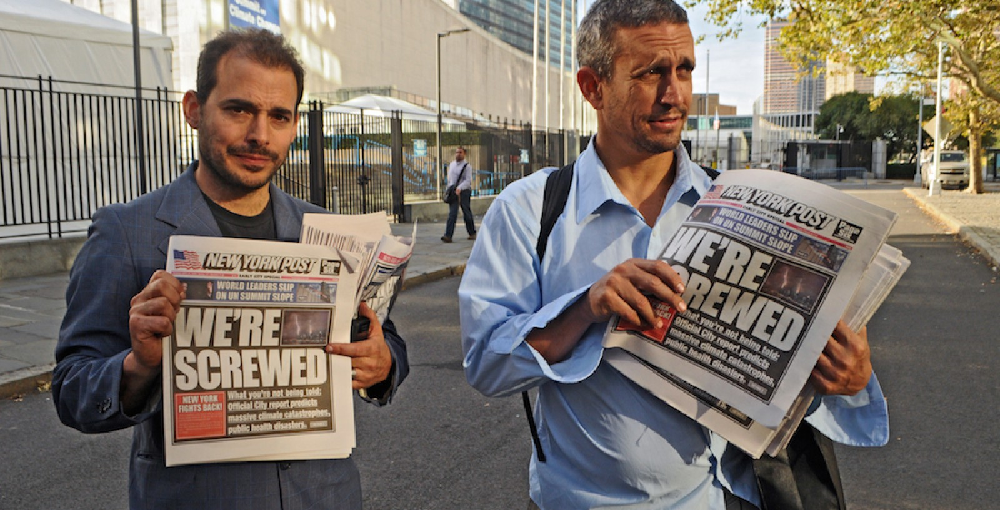
*Mike Bonanno and Andy Bichlbaum holding copies of a fake edition of the New York Post. Photo Credit: Genevieve Jacobson.*

[^43]:Thackara, John. **“How to Thrive in the next Economy: Designing Tomorrow’s World Today."** Thames & Hudson, 2017.

Tactical media artists, such as the Yes Men, among others, during the 90s, could make their work possible thanks to the decreased price in media production. As well, the internet gave some independent and alternative distribution platforms. These two things made it easier for community members to create their own media channels, such as websites, and for them to become producers of their information and distribution. This is inspiring for the possibilities of DIY methods for contemporary communities to create their own means of communication, unique to their culture and their traditions. Populations of different parts of the world under similar conditions and feelings of not having a voice in urban decisions could share their supporting technologies and new relationships could flourish. Structures that have been co-created with playful dynamics in these independent channels, such as Open Structures, could take shape as virtual or spatial games.[^44]

[^44]:**“OpenStructures”**,  openstructures.net/.

**Tactical temporality**

As noted by Roger Paez (see interview p.82 ), there is a mind shift in contemporary society to value the ephemeral as opposed to the permanent: there is “a greater priority to what is lived and what allows us for that instant to exist.” Temporary architecture becomes an essential element for encouraging people to take part in the experience of creating something new and not experienced. Events like Burning Man, where thousands of people gather, are successful not only because of their festivity but also because they are perceived as an ephemeral and out of the ordinary experience. Ephemerality allows for more risk-taking in experimenting with new technologies in public space. They can be embedded into public spaces, making them a testing ground for designing governances and relationships. Designers acting in this capacity act more as a creative orchestrator of different tests that could give insights, rather than acting as a problem-solver in a top-down approach.

Ephemerality allows for more risk-taking in experimenting with new technologies in public space. They can be embedded into public spaces, making them a testing ground for designing governances and relationships. Designers acting in this capacity act more as a creative orchestrator of different tests that could give insights, rather than acting as a problem-solver in a top-down approach.

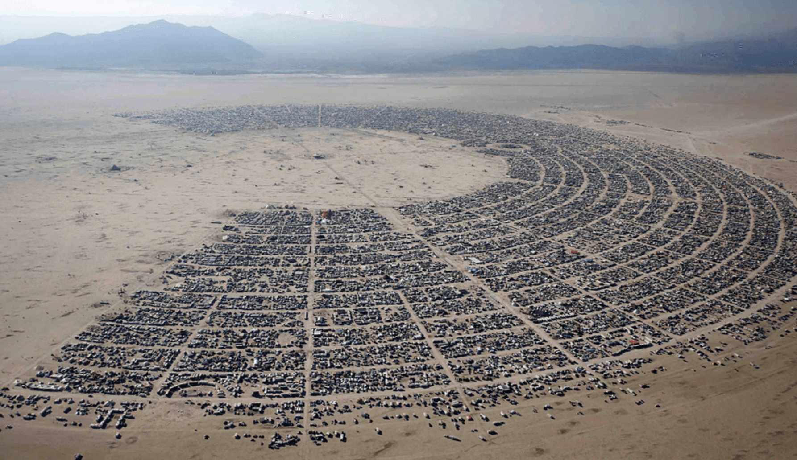
*Aerial view of the Black Rock Desert during the 2013 Burning Man Art and Music Festival.  Jim Urquhart / Reuters*

As stated by de Certeau, a tactic, as the “purview for the non-powerful,” is based directly on observations of the actual environment. As such, ICT technologies could be used to share these tactics among other non-powerful (I refer to the ones who don’t have the ruling narrative in a contested debate) so to better understand their methodologies and react quickly[^45] [^46]. Indeed, a tactic is also characterized by its rapidity and agility. Understanding and demystifying the details in the narratives of tech companies on urban subjects regularly can help them take a stand, and, therefore create a condition for civic agency.

[^45]:Certeau, Michel de. **“The Practice of Everyday Life”**. Univ. of California Press, 2008.

[^46]:Laclau, Ernesto, and Chantal Mouffe. 1992. **“Hegemony and socialist strategy: towards a radical democratic politics”**. London: Verso.

**The role of the designer in place connecting**

The critique of many of the canonical smart cities is that they erase all the horizontality of the city. This then makes human connections of the ground space disappear. Human interactions in the ephemeral experiences are highly valued as what counts is the lived and perceived the “real but ephemeral.” Many metaphors of contemporary urbanism use ecology as inspiration because “the practice of ecology is the forging of relationships.[^47]” A design of relationships and not for competition[^48]. Relating similar characteristics from different public spaces (digital & physical) and understanding the different contexts that made their problems emerge could create links for a shared cause. Connecting communities through their flaws and their unheard voices.

[^47]:Weber, Andreas, et al. **“Matter & Desire: an Erotic Ecology ”**. Chelsea Green Publishing, 2017.

[^48]:Baur, Ruedi. **“Places En Relation.”** Places En Relation, civic-city.org/places..

**Data transparency and ethics in engineering**

Projects like Toronto Waterfront by Google SideWalk are a bad example of data policies and ethics. Even though the project has been highly mediatized, it has not yet conceived an internal consensus on how to protect the data of the inhabitants[^49]. Who decides on the algorithms used? The way that markets show algorithmic solutions as the only solutions are not helping the discussion around the smart city to come. Currently, there is discontinuity in the opinions in public media around it. Hybrid public spaces could be the space to inform and share in creative ways how data-driven urbanism has many ethical issues at stake.

[^49]:Fussell, Sidney. **“The City of the Future Is a Data-Collection Machine.”**  The Atlantic, 21 Nov.

The General Data Protection Regulation is one of the most significant technological innovations from Europe in the recent years. These regulations take action on the problem of data from a human rights perspective. Hybrid public space could be a place to protect this new legislation. It could question continue these concerns and interrogation as the other technological innovations do, promoted by top-down urbanism.

**Hybrid public space as an interface**

There exists many successful “platforms-for-complaining,” such as FixMyStreet[^50] and SeeClickFix[^51] that have been designed for mediating the gap between citizens and their urban instances. Many of these platforms have been designed by engaged citizens or the innovation department of municipalities. Exploring how these virtual spaces can take shape in physical public places seems to be a common experimental task for designers, architects and stakeholders. The image of municipalities could also be changed, as this seems like a more progressive approach compared to a “click & vote” dynamic[^52].

[^50]:**“FixMyStreet.”**, www.fixmystreet.com/.

[^51]: **“SeeClickFix.”**, www.seeclickfix.com/.

[^52]:**“Budget Participatif”**, budgetparticipatif.paris.fr/bp/.

*SeeClickFix promotional video (SeeClickFix.com)*

# Current practices of Hybrid Public Space making

In the following portion of the thesis, I will analyse three projects and shed light on their successful qualities as well as their failures. Comparison will allow us to formulate criteria to create successful and fruitful participatory urbanism, as well as the architectural elements that could be useful in shaping it.

For this analysis, I will consider the materiality, construction, aesthetics and overall production of these projects.
The case scenarios proposed are selected based on the following criteria:

**Their outcome is something physical in a public space.**
**There is a digital component of their creation.**
**There is a consensus necessary in their implementation.**

## Wikiplaza

> “WikiPlaza was an experimental, long-term project that brought together several collectives of architects, hackers and activists at a time in which many cities in Spain were brimming over with self-managed creative activity operating in a harsh context of neoliberal policies. In the face of the gradual deactivation of public space, the idea sprung up of generating a hybrid public space in which to experiment with information and communication technologies as tools for individual and communal emancipation, based on free software and hardware, web 2.0 tools and open and transparent use of spaces and systems. The project was developed by a multidisciplinary team coordinated by Sergio Moreno and Laura Andrade from Hackitectura, and four prototypes were created between 2008 and 2011.WikiPlaza is an infrastructure made out of lightweight architectural elements and technological systems (hardware, NetWare, software) designed to be used by the public in an open and participatory manner, to share knowledge and experiences, to access local and remote resources, to connect to other people and locations. The concept is based on a modular structure, which gives it the maximum flexibility to adapt to different contexts and budgets, and which allows the independent development of the different modules, including: Web TV; Open MediaLab, Open Urban Screen and Open Performance”.
> 
http://x.hackitectura.net/en/

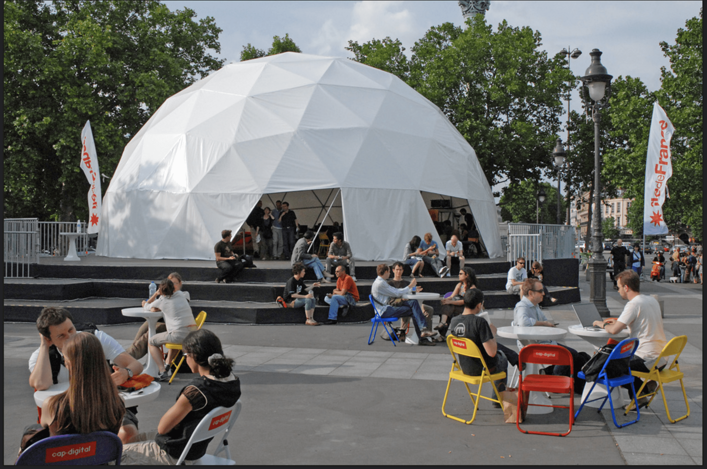
*WikiPlaza, place de la Bastille - CC Alexandre Hervaud*

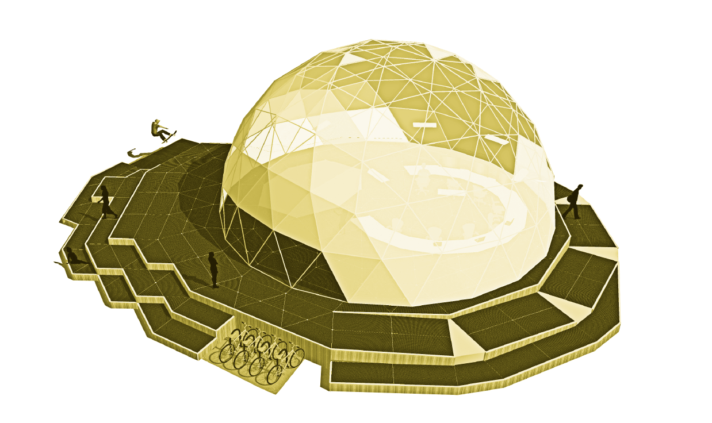
*Rendering of Wikiplaza*

*Wikiplaza, Courtesy Futur en Seine*

 Wikis stand out as one of the iconic social technologies of our age and have brought about a transformation, an evolution in the approach to the encyclopedia, journalism, image storage and knowledge management. Can this technology be applied to physical spaces?

Taking as an example the success of Wikipedia, one of the most significant and most useful repositories for collective knowledge with a minimum of central supervision, the collective Hackitectura tried to tackle the question of how a physical space like this could co-created. Their guiding questions were “can wiki social technology be applied to the physical world?” and “can wiki help redefine urban design?”

Wikiplaza project was an attempt to commemorate the people’s freedom 25 years after the approval of the Spanish Constitution. More than this, it was a research initiative that started in 2000 by the collective Hackitectura in Spain on how the flows of information were interacting in public space during a time when public space in Spain was heavily over-codified by private activities and entities. In their initial proposal for the city of Sevilla, Hackitectura put forward the concept of enhancing the public space by connecting digital flows with the built environment as well as data and images that would be constructed and inhabited according to the social networks model. This concept was influenced by an earlier project of the collective called “Multitud Conectada,” which had the intention of generating a public space that was local and global, physical and digital, employing real-time audio-video connections between Mexico city, Bogota, Sevilla and Canarias.

Wikiplaza took place at the Parisian festival Futur en Seine in 2009, where the collective tried to make a proof of concept. Their background in architecture and computer engineering led them to think that the structures of power of free software and hacker culture offered an exceptional point of reference for thinking about the production of territory, cities and public spaces. They believed that the use of social technologies could strengthen the autonomy of public spaces and its management. Additionally, they believed that the creation of commons in public space could be organised better to lead to a greater sense of belonging for users.

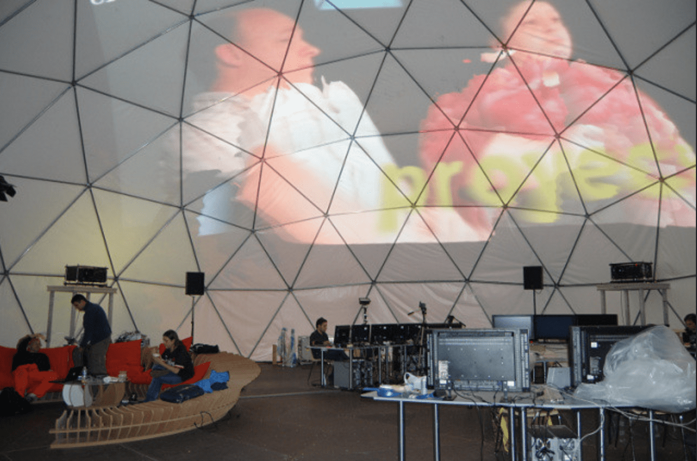
*Wikiplaza, Courtesy Futur en Seine*

In order to create these technical, social and mental ecologies, they structured the space inside in different modules:

**Mille Plateaux:** A space to have talks and discussions on contemporary issues. The events here were recorded and live streamed through an open source streaming engine using Pure Data.

**Situation Room:** This was the central control room of Wikiplaza. It served as a metaphor for the situation room that was open to the public so that everybody could see what was going on in real time by the people sitting and working in the space.[^53]

**Open MediaLab:** A space to host workshops similar to what a fab lab would have today.

**Open Performance:** A space dedicated for performances and digital performing artists to expose their work.

**Urban screen:** The surface of the dome was projected from the inside, creating a 5x5 screen to intrigue the passerby of the night. It shared events that took place during the day.

[^53]:**“Situation Room.”** Wikipedia, Wikimedia Foundation, 20 Sept. 2018,

These five modules were composed of **Spaceware, Hardware, NetWare, Software and Humanware**. The division of modules and their components were the vision Hackitectura had for a space where socio-technical-architectural machines would create the precondition for generating a positive environment for discussion and participation in public space. This assemblage is what they called in their research the “ecosophic machine,” making a reference to Felix Guattari in his book co-authored with Gilles Deleuze, “A Thousand Plateaus” and also in his book “Chaosmosis.[^54] [^55]”, Their intention in creating this metaphoric language around Wikiplaza was to develop a method that could be used in other spaces around the world, where inhabitants could adapt them depending the resources available and the communities interested in participating[^56].

*Hackitectura Wikiplaza, Request for comments*

*Situation room designed by IBM*

[^54]:Deleuze, Gilles, and Félix Guattari. 2004. “A Thousand Plateaus: Capitalism and Schizophrenia”. London: Continuum.

[^55]:Guattari Félix. “Chaosmosis: an Ethico-Aesthetic Paradigm”. Power Publications, 1995.

[^56]:Pérez de Lama, José aka osfa **“Art as Machine(ecosophic):Guattari in the WikiPlaza”**, 2009, Manifestolibri Uninomade, Rome; 
“For Guattari, a machine is an assembly of diverse components leading to a certain occurrence of the real; social, subjective, technological, energy, corporeal, space-time components. And so we speak of the post-Ford capitalist machine, the television machine, the web 2.0 machine,the university machine, the social centre machine; machines of desire, machines of aesthetic creation. In my interpretation —as in Foucault’s (Deleuze, 1987)— machines delimit the visible and the expressible, and establish certain relations of power.”

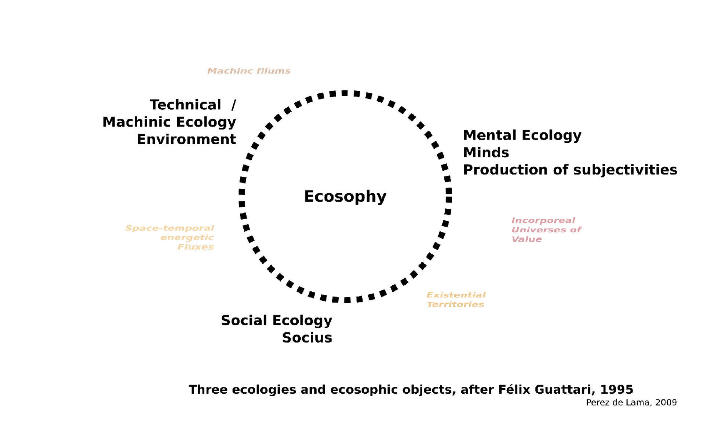
*Hackitectura, Wikiplaza, Request for comments*

Wikiplaza was prototyped in the form of an Open Source Architecture as it was intended to create a physical and philosophical structure made from a cooperative effort. As well, it was made so its design could be shared and transformed through a dynamic archive[^57]. As with many open source projects, their success depended on their quality of documentation and the engagement created around the principles of the project.

[^57]:Ratti, Carlo, and Matthew Claudel. **“Open Source Architecture”**. Thames and Hudson, 2015.

Even though the collective reproduced the project two more times in different cities in Spain, the only time that the project was attempted since was in Sao Paulo by Wikipraça in 2015. Wikipraça did not use this complex network organisation theorised by Hackitectura. Instead, they only used Facebook groups and WhatsApp as they were much less concerned with only using free software tools and instead used a mix of software[^58].One can’t help but notice a lack of investment in the ongoing life of the Hackitectura’s work as the dedicated website, wikiplaza.org, no longer exists and the collective Hackitectura disintegrated in 2011. This could be explained by the fact that the project aimed to be a research project and not an long term project. By not leaving a notable trace of its manifestations since 2009 in Paris, it is hard to imagine on how a similar institutionalised spaced could develop from independent civic initiatives.

[^58]:Wikipraca. **“Wikipraca/Wikipraca-WikiSquare.”** GitHub, 6 Nov. 2015

*Wikiplaza, Courtesy Futur en Seine*

The structure of the Wikiplaza was a Buckminster Fuller geodesic dome because of its easily moveable characteristics but also because the symbolism that it represents as a utopic structure. Buckminster Fuller engaged with a Euclidean-influenced philosophy, in which “scientific design” could inspire new forms of representation of the world. These representations could arouse a harmonious future with new artefacts that have the power to influence human behaviour and the habits of individuals human beings[^59].Moreover, they were staging a situation inspired by Situationist ideas, in which there are no spectators or actors. Instead, everyone who came in or was present via streaming played an important role in the co-construction of the space.

[^59]:Buckminster Fuller and Systems Theory.

*Richard Buckminster, 1954*

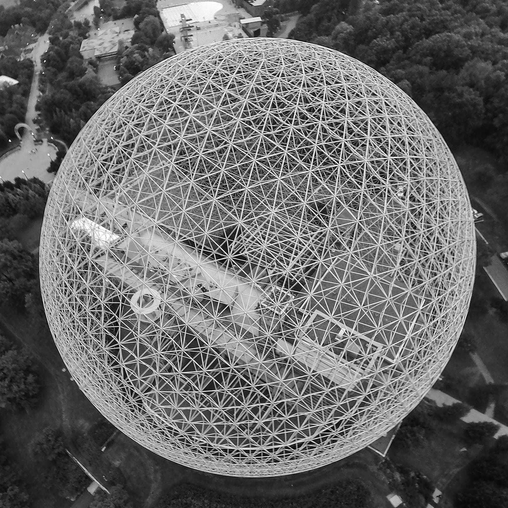
*Richard Buckminster Fuller, Biosphere, Montréal, 1967. Photo D.C. Robidoux*

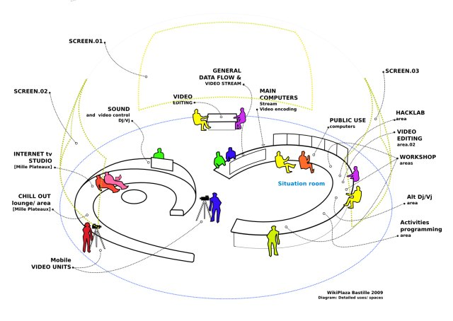
*Hackitectura, Wikiplaza, Request for comments*

Nevertheless, Wikiplaza was set in La Place de la Bastille in Paris, a space that has a particular history related to the French Revolution and a space that serves as a hub for social activities and street protest such as Nuit Debout and Gilets Jaunes. From a functional point of view, it is also a meeting point for pedestrians finding their way to their destination. The symbology of the space and the flux of people reinforced the metaphor of the “ecosophic machine” and gave easy access to people to participate in the events in the dome.Would this “ecosophic machine” work as well in other less frequented and less symbolic spaces? If so, how could a space like this, requiring a lot of human engagement and technological expertise, exist?

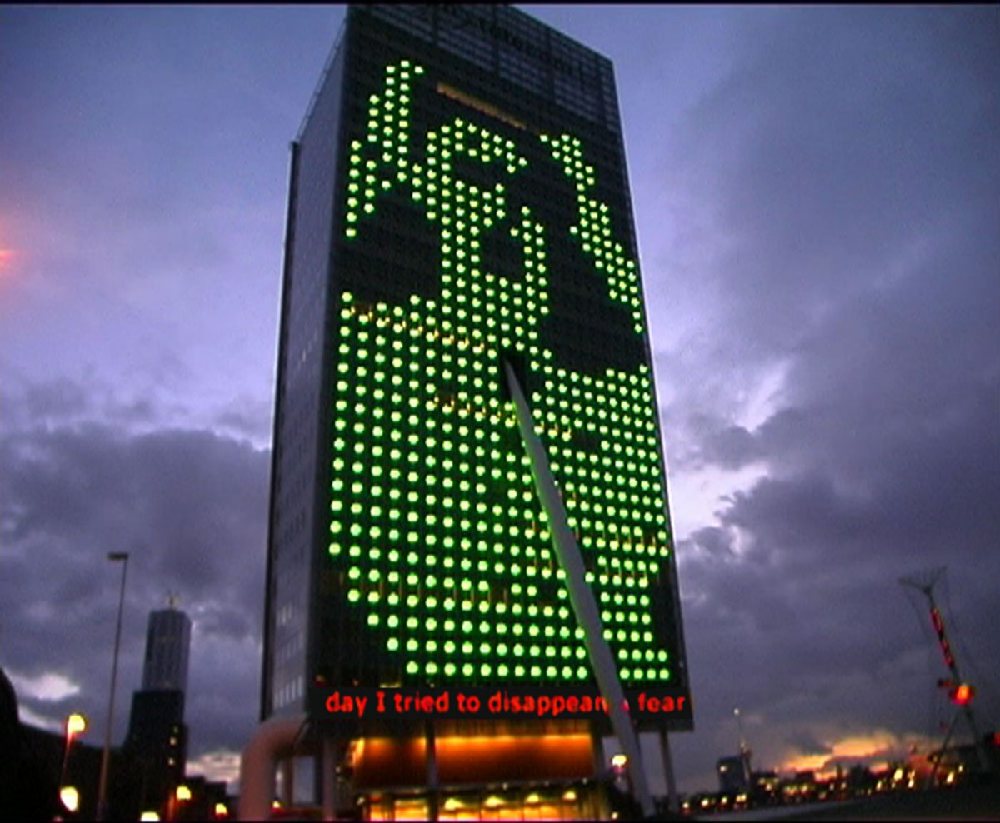
*KPN tower, Rotterdam, Courtesy  Studio Dumbar.*

Wikiplaza, in its off the grid manner of being put into an existing place, is guerrilla media architecture. Indeed, the technologies that mediate the public space with its citizens such as urban screens, CCTV cameras and sensors embedded for surveillance, seem to be more of mechanisms of control rather than mechanisms of emancipation. For example, urban screens mostly show advertising and city monitoring sensors are used for tracking individuals. This shows how the implementation for technology in public space is an arena invested in mainly by companies and not by individuals. This is predominantly because of the costs and the technical capabilities needed to implement them. In this regard, Wikiplaza was a symbolic statement from its initiators that media architecture can be created by entities other than tech companies. Nevertheless, from the Wikiplaza research initiative there has not been a common framework for co-creating this particular DIT (Do-It-Together) media architecture. However, many other examples can be found in projects such as Smart Citizen[^60] or Open Structures[^61], where a possible outcome may impact media architecture production.

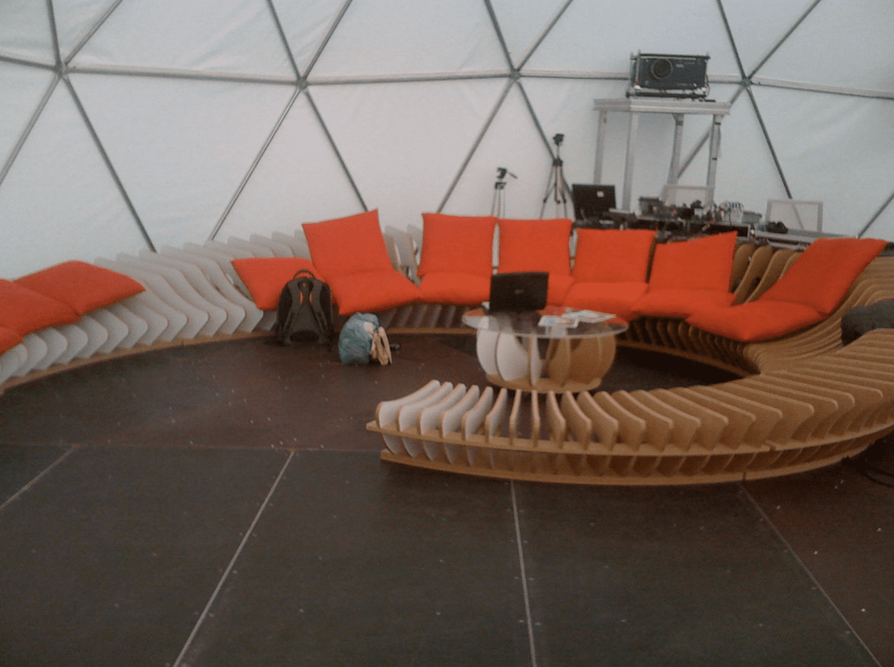
*Wikiplaza, Courtesy Futur en Seine*

Still, one could think of WikiPlaza within the framework of the Temporary Autonomous Zone[^62]. There is a construction of values in the mere act of “revaluation of values.” The WikiPlaza project tried to do this by creating change in everyday lives of the people in the space. However, one can also see that based on the thematics that were discussed and explored, many felt overwhelmed by the amount of technology in the space leading them to think of the space as a “geek” hub[^63]. As well, while the collective had the permit to do it, the security that remained in the public space made difficult for this utopic project to take place as planned. There were always security guards present and images of institutions involved that in the days that the event took place.

[^60]:**“Citizen Science Platform for Participatory Processes of the People in the Cities.”** Smart Citizen, 
smartcitizen.me/.

[^61]:**“OpenStructures”**,  openstructures.net/.

[^62]:Hakim Bey author. **“T.A.Z. : The Temporary Autonomous Zone, Ontological Anarchy, Poetic Terrorism.”** Brooklyn, NY: Autonomedia, 2003.

[^63]:Hunsinger, Jeremy, and Andrew Schrock. **“The Democratization of Hacking and Making.”** New Media & Society 18, no. 4 (April 1, 2016)*“Hacker and maker spaces are community workshops that promote notions of open-access and equal participation. Yet, they tend to embrace a contradiction. Their egalitarian goals paradoxically reflect a masculine geek identity anchored by an exclusionary “meritocracy.”*

Even though their initial intention was to provide modules and a base that were replicable in other cities, the collective did not take into account that the legislation of public space around the world differs. Hackitectura needed to foresee the necessity of a proper study of security law and contextual risk analysis for a Wikiplaza to exist elsewhere.

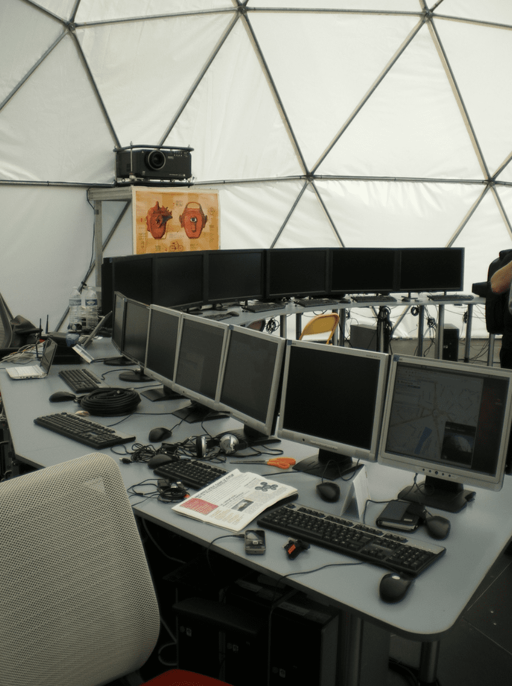
*Wikiplaza, Courtesy Futur en Seine*

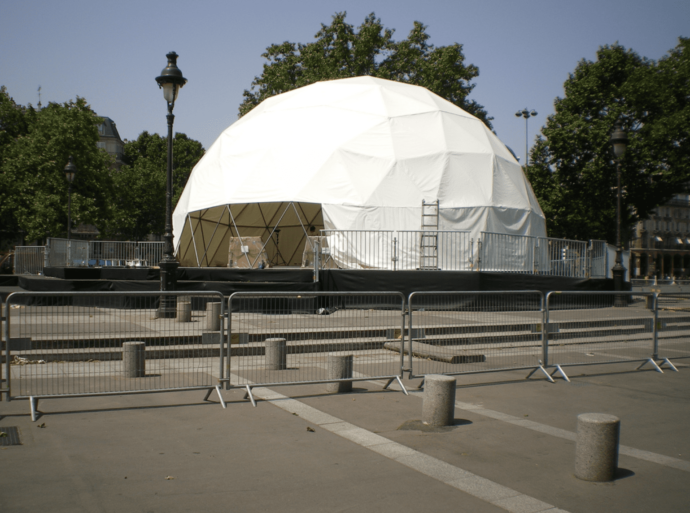
*Wikiplaza, Courtesy Futur en Seine*

## Luchtsingel

> “Hofplein was once a lively spot in the heart of Rotterdam. After twenty years, this area has been neglected and detached. The Hofplein’ surroundings illustrate a blind spot in the centre of the city. Rotterdam Central District carries the advantage of being a prime location in the city, however it is dominated by abandoned open spaces and vacant high rise buildings. In the context of the current market-oriented economy, it would take years for redevelopment to begin. The city could afford to wait: yet, the question of space is too complex to address in the future. Therefore it was the responsibility of Rotterdam to react to the problem of abandoned and derelict spaces. In order to do so, new entrepreneurs and residents should be enthused to contribute to the development of a progressive public space.”

http://www.luchtsingel.org/en/

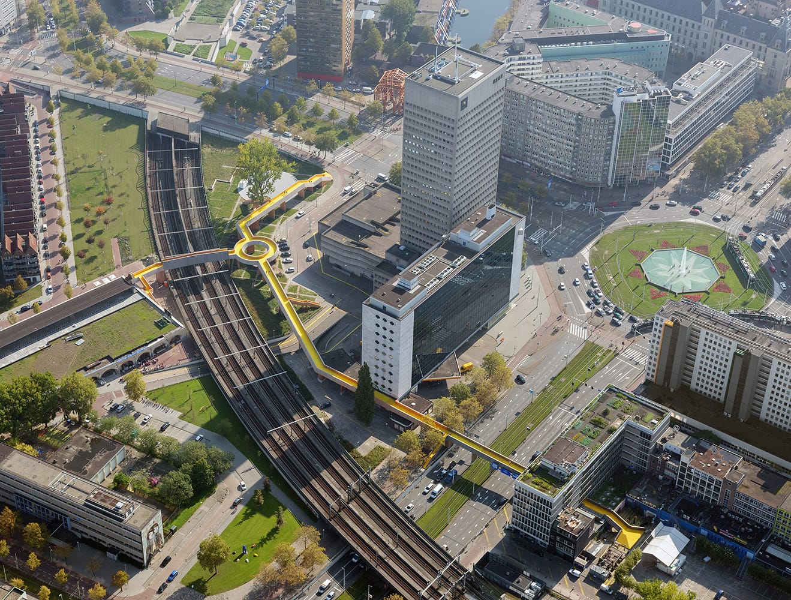
*ZUS*

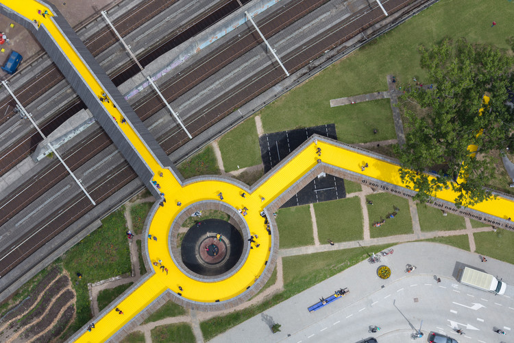
*ZUS*

ZUS (Zone Urbaine Sensible) City Landscape Architecture office by Elma van Boxel & Kristian Koreman moved to Rotterdam in 2000 with the idea to create a practice as urban designers influenced by the rhizomatic concept by Felix Guattari[^64]. The rhizome inspired them to follow nonlinear processes of creation and helped articulate their ideas on the network society for which they aspire to design: a society shaped by technology, politics, spatial relationships and media.

[^64]:Deleuze, Gilles, and Guattari Félix. **“Rhizome”**. Minuit, 1976

Nevertheless, ZUS acknowledged their condition in the Dutch liberal economy of the 90s, which led them to create a well-structured business plan. As young professionals, they self-published an independent magazine with their thoughts on the city to come, exemplified by renderings of “unsolicited proposals.[^65]” The magazine was distributed to the citizens of Rotterdam so that they would “dream or hate the future" through speculative thinking on what they wanted their built environment to be and how they wanted to live together.

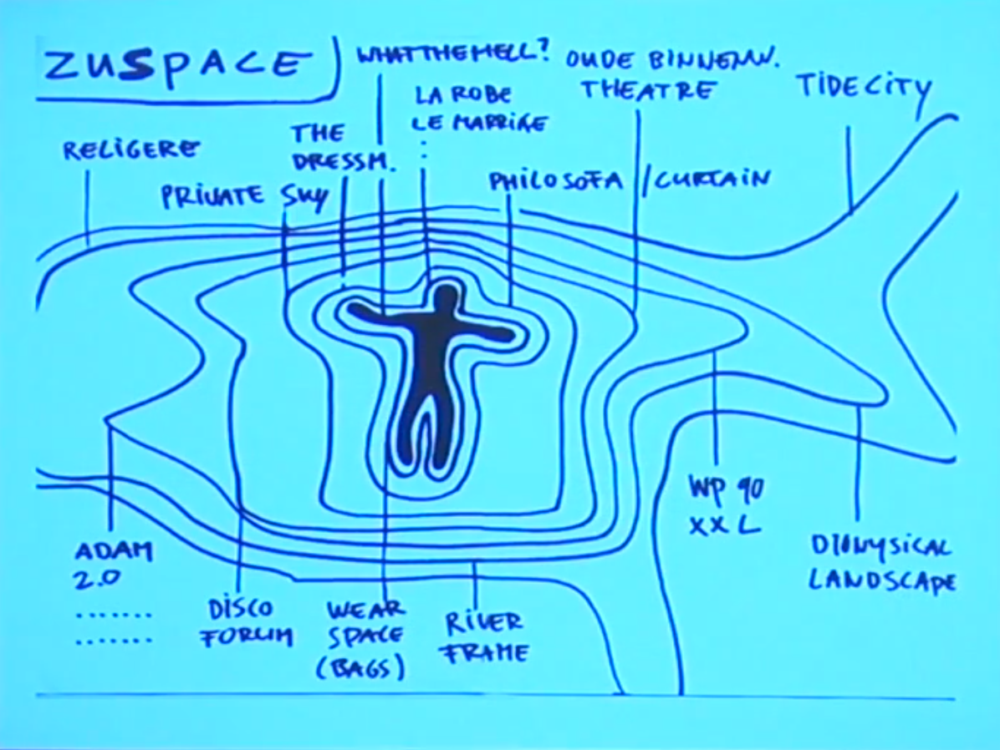
*ZUS*

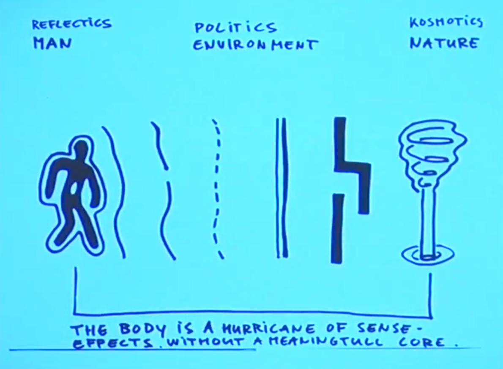
*ZUS*

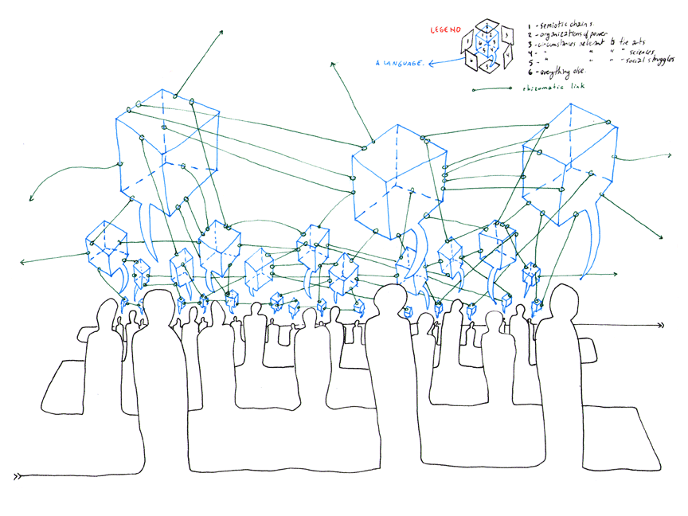
*Illustration Marc Ngui*

As Rotterdam’s buildings were destroyed by bombing during the Second World War, the city has been an ideal environment for experimentation and research for many urban planners. Consequently, it has the most urban plans per square meter in Europe after the 50s. As well, Rotterdam is one of the most important harbours in The Netherlands. One out of three inhabitants of the city is a foreigner. It has a young population and people stay for only a short period of time. From an urban perspective, this leads to many empty spaces in the city. To respond to these conditions, the chief architect advisor of The Netherlands advocated for halting new construction in the city and instead to think of how to use empty spaces for new value creation. Despite these considerations, many architecture studios proposed in their renderings and proposals new constructions and buildings for business and commerce because capital was needed to invest in the city center.

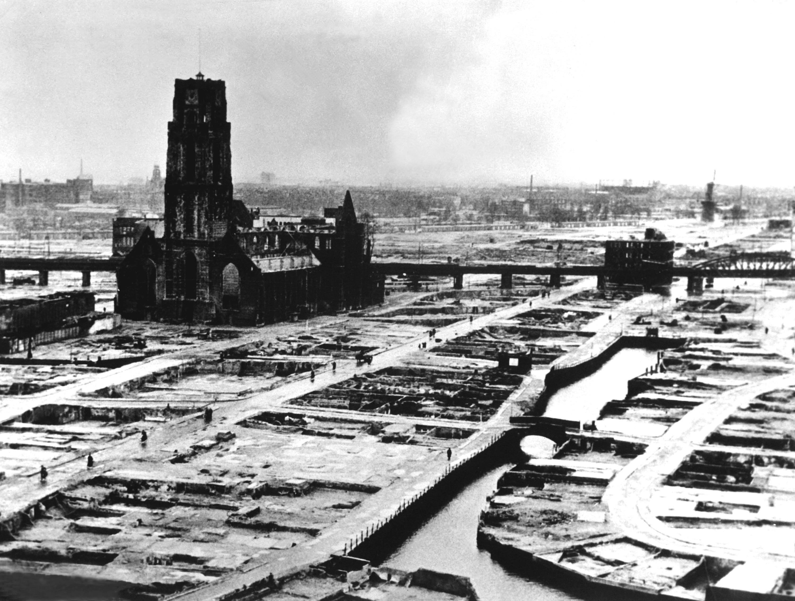
*Rotterdam Photo Archive*

 [^65]:Koreman, Kristian. **“Pro-Active Landscapes.”** Architecture Fall 2015 Lecture Series - September 29, 2015 at Slocum Hall. Syracuse, Syracuse University School of Architecture.

In 2011, the municipality of Rotterdam approved a plan to demolish the building where ZUS had their office in order to build a skyscraper that would mainly host offices and housing. It didn’t take ZUS long to respond as time was not on their side for convincing the authorities that there was alternative potential in that building and in the public spaces around it.

ZUS tried to transform the building appearance and the surrounding public areas into being more appealing to the municipality. Being urbanists themselves, ZUS took the plans that were posted on the internet from the building proposal and started an iterative process of comparing the renderings to the actual environment to make it look similar. Consequently, they showed to the city authorities that their dream space could be done in the near future with some effort of people rather than in 30 years as the construction schedule indicated. The praxis of ZUS was known by many of the neighbours in Rotterdam who saw this effort as their own, since the demolition of the building would change the current state of the place.

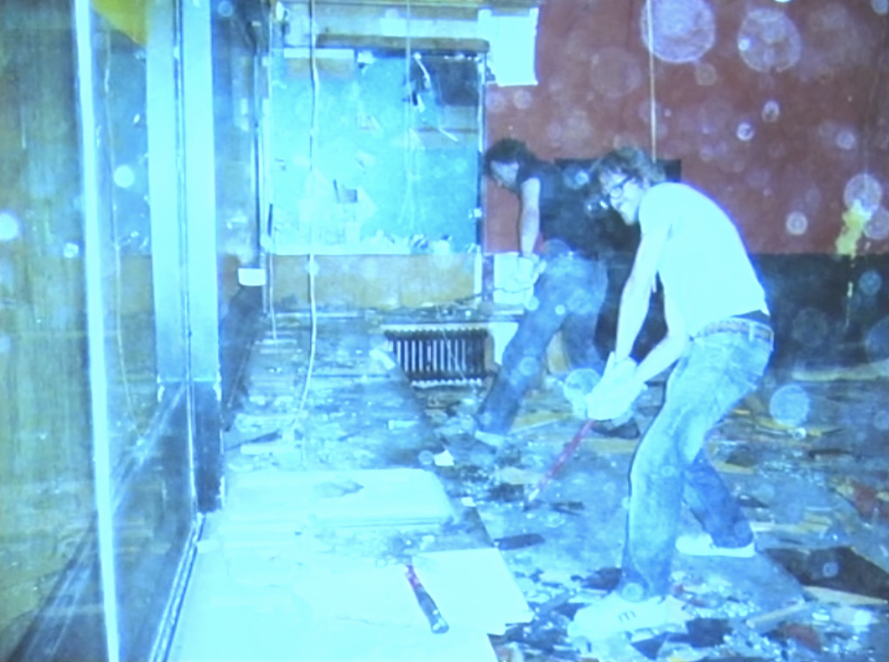
*ZUS*

ZUS launched a provocative open call via Facebook groups, posters and public speaking for people to populate the space in creative ways. Diverse activities like temporary restaurants, flash mobs, beer gardens, dancing spaces and other festive events emerged from the initiative of many of the neighbours and people who struggled to find spaces in which to organise their initiatives. Some think of placemaking as a placeholder term for explaining the process they went through: giving people the possibility to independently define the use of their space[^66]. The potential that space could be explored through this process and serve as a collective argument for maintaining the activities that nourished there.

[^66]:**“What Is Placemaking?”** , www.pps.org/article/what-is-placemaking.

The developer of the project gave second thoughts on the plan of the project and gave the building four more years for the demolition plan to be implemented. This gave ZUS the time to come up with a consolidated plan of action. One can’t help but notice that the community around Hofplein was stimulated by many of the activities planned. The activities encouraged face-to-face encounters, something that Richard Sennett frames in his concept of the Open City and in his advising to UN Habitat (2016)[^67]. Sennet does so by applying the Levinasian notion of “neighbor[^68]” as new neighbours were formed through meeting the others. He states:

[^67]:**“UN-Habitat,Key Messages from the Future of Places”**, opened the 25 September 2018)

> “The Levinasian notion of the neighbour to the urban condition. which It requires skill to be intensely aware of somebody else, to interact with them, and yet not to try and abolish the boundaries between self and other. It’s a particularly urban concept because the Levinasian version of the neighbour, is something that allows strangers to remain stranger in some sense, to each other.Which doesn’t suppose the local community is ultimately the ethical foundation of a city–it’s moral foundation.That people can remain apart, and yet mutually aware and interactive”[^69]
>

[^68]:Emmanuel Levinas, “Totality and Infinity: An Essay on Exteriority”,1961, trans. from the French by Alphonso Lingis (Pittsburgh, PA: Duquesque University Press 1969)

[^69]:Sennett, Richard. “The Open City”, Harvard School of Design Talks, 17 Oct. 2017

Their proposal proves that temporary uses of space can produce a change in the culture of planning by creating the conditions for a possible appropriation of a place by its users. ZUS launched a crowdfunding platform in 2010 called “I Make Rotterdam,” where people could invest in the construction of a bridge that would link all the public spaces surrounding the building as well as other unoccupied buildings,they called this bridge Luchtsingel which translates to english as “Air Lane”. Neighbours and future users could buy one or more of the 17,000 wooden planks that where the units for constructing the bridge. Plank owners could write their names or messages on it, thus developing a sense of ownership in the project. This tactic also helped attain more time before a market-based urbanism project might endanger the space. A hybrid public space was formed as their physical space, and then created and crystallised in a virtual form.

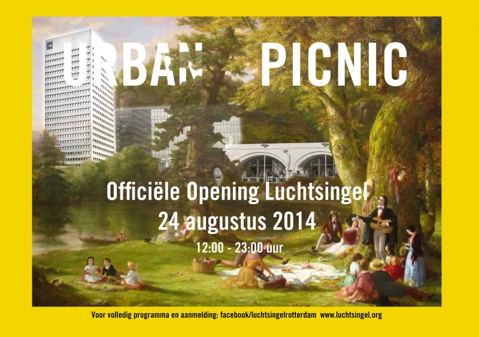
*ZUS*

This crowdfunded approach to infrastructure was revolutionary. It opened up the imagination for other participatory methods for conceiving of public infrastructure. Citizens could play a much more significant role in fulfilling their needs and experimentation with their own spaces. Three tactics supported the crowdfunded campaign:


**Community Building**

ZUS created a website that showcased the possibilities of the project and the opinions of people from the area based on interviews. The website also showcased the diverse partners of the project that formed through the gatherings and events around the building. Even some Dutch celebrities showed support for the initiative.

**Unexpected Events**

A series of flash mobs and events organised by volunteers showed the potential of this area as an interesting economic place for investment and social life. Citizens of the modern metropolis are in a “reserved urban state” when entering to public space. That is, they typically do not show their emotions, avoid contact with individuals and are unlikely to engage in surprise activities in the spaces[^70]. By implementing flash-mobs, citizens became participants, and had a positive collective experience that creates new bonds with others. The feeling of being in a creative environment emerged.

[^70]:Boullier, D. (2010), “La ville événement : foules et publics urbains”, Paris, PUF.

**Reaching beyond the comfort zone**

ZUS went out of their comfort zone and spoke at public events to agitate the public opinion on the project.

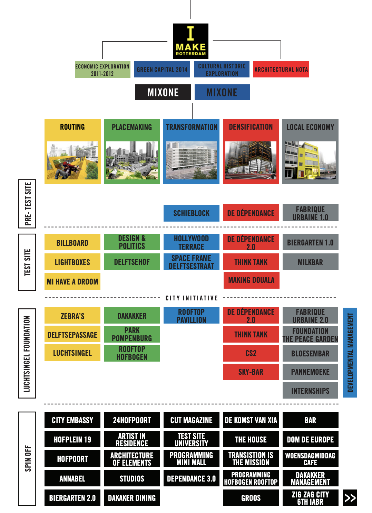
*ZUS*

The Luchtsingel is now an essential infrastructure in Rotterdam and maintains in high use by the public. Because of the strong media attention that the project had, the maintenance of the bridge is managed by volunteers who meet regularly to repaint it and replace some of the planks for new ones. The planks are still available for purchase and inscription. As stated by ZUS, “We should stop instant urbanism and do more permanent temporality.[^71]”

[^71]:**“Permanent Temporality - Jouke Sieswerda, ZUS.”** Vimeo, 20 Nov. 2018

ZUS supports an iterative process of doing events and promoting new events in Hofplein through a bottom-up fashion. This process creates a permanent revaluing of the potential of public space by the citizens and institutions. This idea was a fundamental argument before starting the crowdfunding campaign because they also needed bigger institutions and companies to believe in the project and invest in it. In this sense, ZUS’ tripartite strategy of “a design, business plan and alliances” was the key to the success of the project.

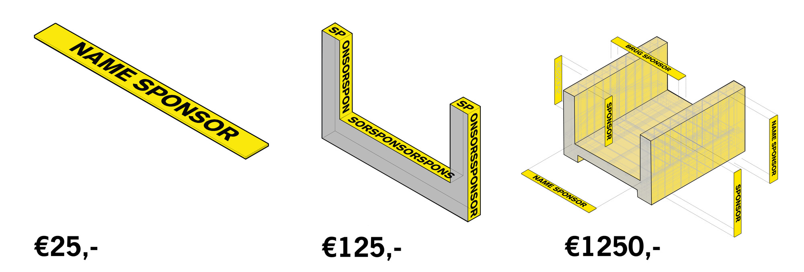
*ZUS*

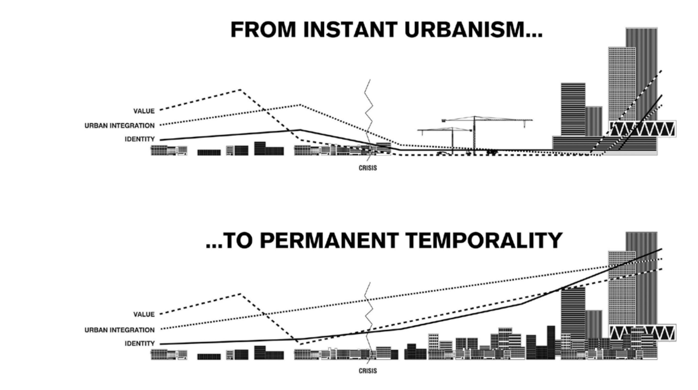
*ZUS*

It is important to note that the Luchtsingel construction was facilitated by the participation methods, public opinion and legal structures in The Netherlands that helped the project license to be given in only six months. This contextual condition is not present in many parts of the world, where bureaucratic processes can take years for a project like this to take place.

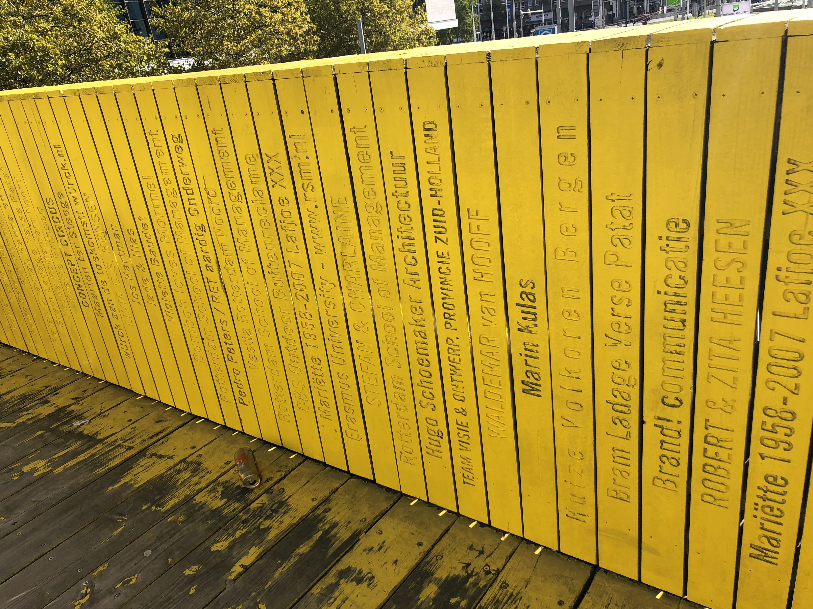
*ZUS*

Traditionally, architects and urbanists have little say in project funding. But, through crowdfunded campaigns, they can take an active role in it, engaging and sharing with the public their vision on how they think a project could exist without the means of the public tax. The public intelligence of citizens and their participation, in the Habermasian-sense, is then applied in combination with Sennett’s notion of action taken in the physical space. Other projects that exemplify this trend and participative urbanism are IOBY[^72] and Neighborland[^73], which connect citizens’ opinions with other stakeholders in the process of construction of infrastructure.,

[^72]:**[“In our backyards”](https://www.ioby.org/)** 

[^73]:**[“Neighborland”](https://neighborland.com/ )** 

For the analysis of this case, it is helpful to analyse their actions through the concepts of strategy and tactic by Michel de Certeau in **“The Practice of Everyday Life”**[^74] (1984).In considering ZUS’ environment, resources and time, they rapidly developed a series of small acts that created notable action againts the ruling institutions.

[^74]:de Certeau, Michel. **“The Practice of Everyday Life”**, chap. 7, trans. Steven Rendall, University of California Press, Berkeley 1984

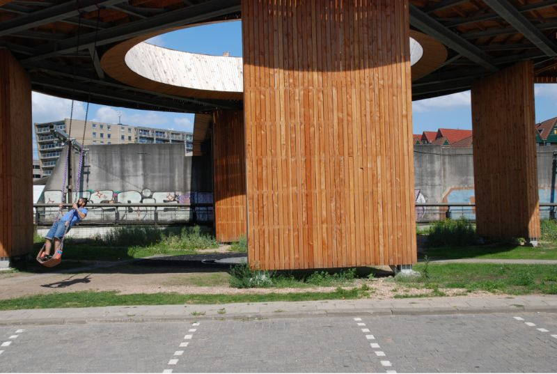
*ZUS*

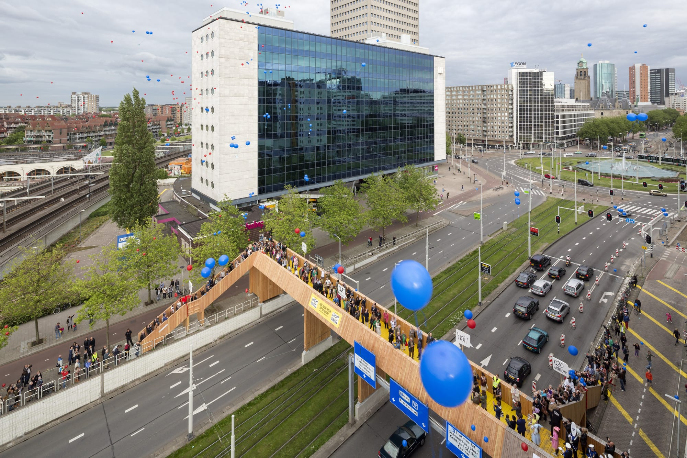
*ZUS*

*ZUS*

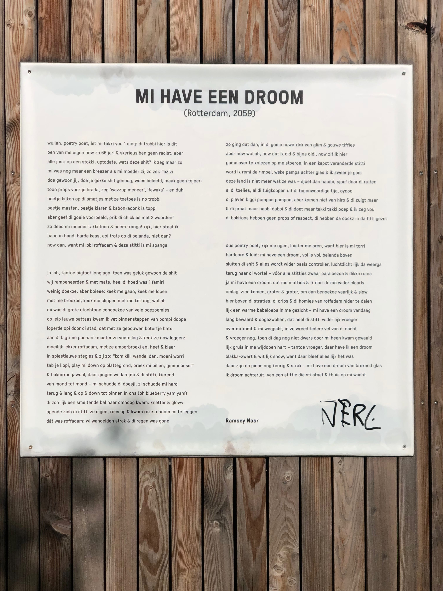
*ZUS*

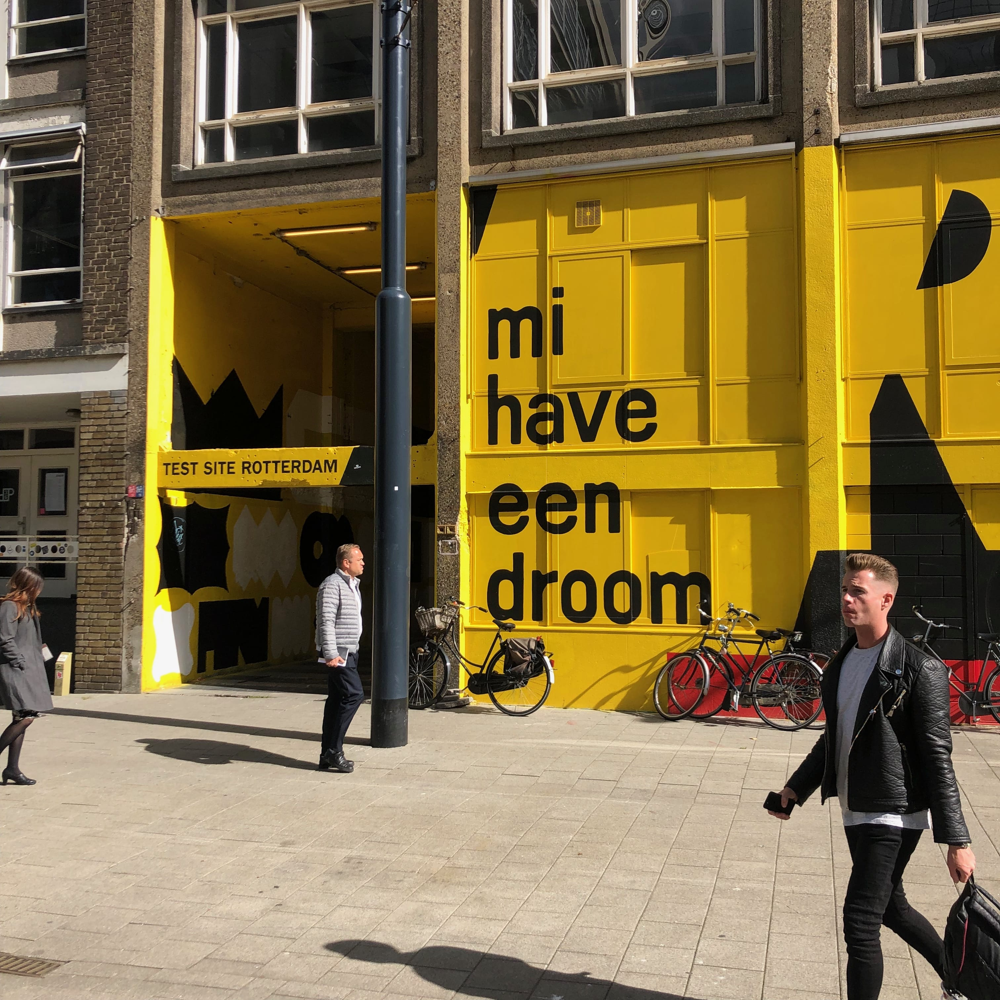
*ZUS*

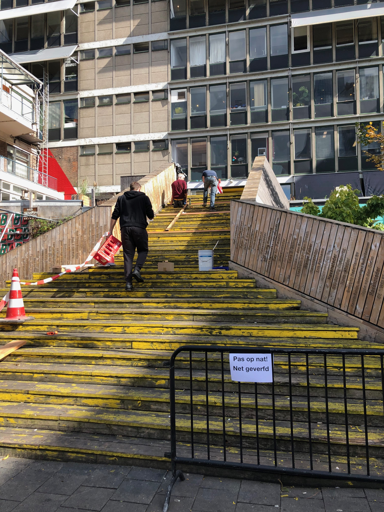
*ZUS*

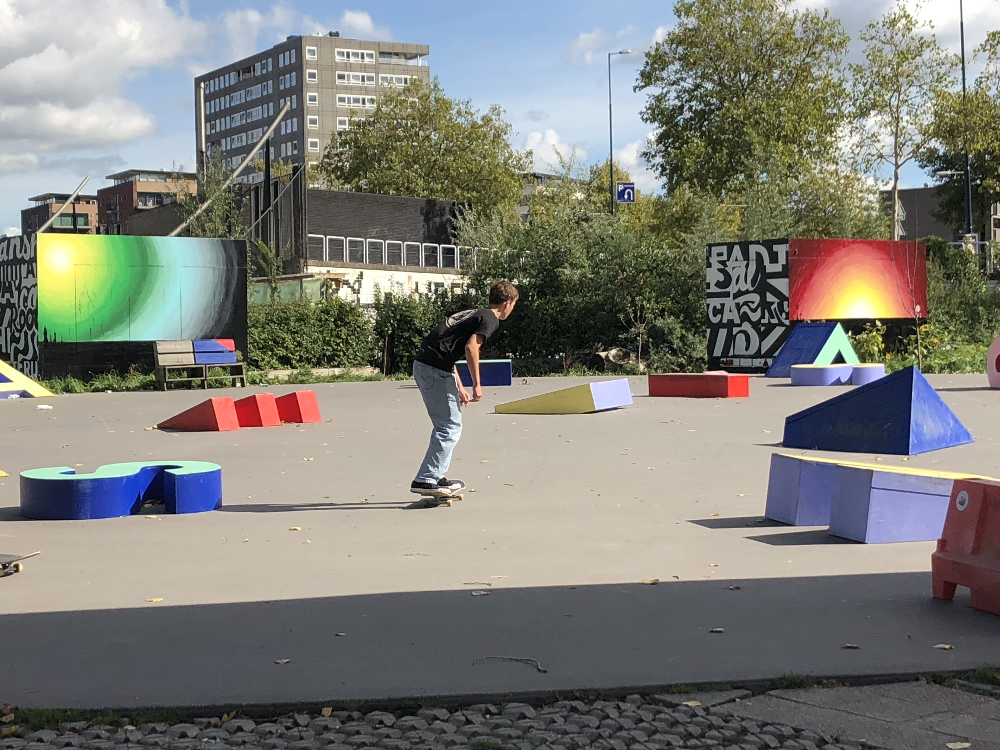
*ZUS*

## Partizaning

>“Throughout the 20th century, artistic movements have sought to challenge and break from traditional notions of art. This constant blurring of boundaries now means that any act or work done by an artist may be regarded as an object of art. Today, the distinction between art and non-art is almost impossible to make, and any classification is subjective.

>Since the 1920s, radical artistic experiments have sought to destroy the boundaries between art and everyday life. Old industrial buildings, city streets, the Internet and mass media are increasingly replacing museums and galleries as the ideal forums and exhibition venues for modern art.

>Today’s activist urban residents do not think of art a distinct system. They use the language of art as a tool to challenge and change their daily reality: from DIY urban repair to struggling for new forms of state representation.

>Unsanctioned interventions and interactions in our urban environments, combined with mass media connectivity, have become effective transformative tactics for a new, alternative vision for the future.

>Partizaning is not just the name of our website. It is also a term to define a new phenomenon and strategy at the intersection of street art and social activism. We devised this term in Russia, where we demonstrate in a revolutionary tradition how self-motivated, unauthorized statements and unsolicited action can become key drivers of social and cultural change.

>Our goal is to reflect and promote the idea of art-based DIY activism aimed at rethinking, restructuring and improving urban environments and communities.” 

>Manifesto Partizaning[^75]

[^75]:**“Manifesto.”** Partizaning, eng.partizaning.org

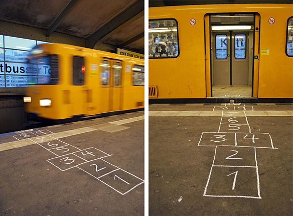
*Brad Downey*

>“The concept of temporality emerges as an important part of the known reality, when cities are analysed over large temporal-spans, ephemerality emerges as an important state in the life cycle of every built environment” 

>Rahul Mehrotra & Felipe Vera

Partizaning is a Moscow-based collective of artists, researchers and writers who maintain an online platform and are responsible for street hacks in Russia and in cities around the world. It was founded by Igor Ponosov and two friends, who were doing street art and graffiti together for almost 10 years in their spare time. By 2011, they questioned their practice and tried to give it a social meaning. They saw many things in Moscow that displeased them and they were willing to act to change these things. The Russian term partizaning translates to “guerrilla” or “resistant.”

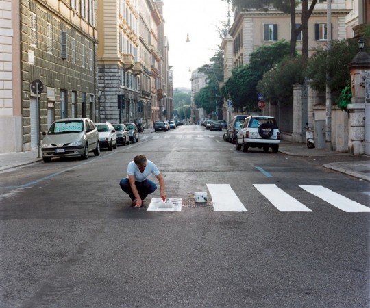
*Didier Courbet*

Through social media in 2011, they discovered other movements in the USA and Europe that were also doing urban hacks. These other movements employed the notion of tactic to label their site-specific actions and small happenings. As cited on their website, Partizaning’s goal is to “explore the role of art as a practical tool for inclusive city regeneration and social activism.” In the same year, the collective launched a Russian language website where the idea was to share their urban tactics and their thoughts on problems in the city. They believed that increasing shared socio-political realities and dissatisfactions could be strategically addressed by using art-based “partizaning” tactics. By creating their own media, they avoided the label of “street activist” or “street artists,” which are typically used by big art media or political activists. Their website documents and analyses the role of art in reshaping public spaces, cities and human interactions. The website also serves to inspire people by showcasing projects in the public space as creative achievements of social transformation through DIY and participatory actions.

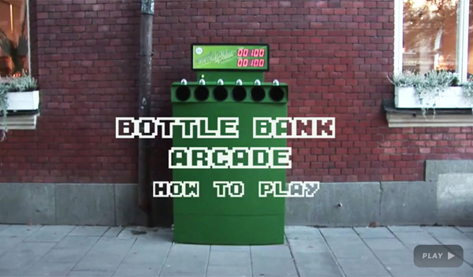
*Didier Courbet*

The power structures in post-soviet Russia are one of the main obstacles for a participatory urban planning. This is because much of the physical public space is used solely for commercial purposes. This is also the case in the mono-mediatic landscape in Russia, which creates resistance towards the idea of self-organisation and a lack of the belief that people “can take the city back.” Partizaning emerges in this context, with the collective's founders believing that resistance is necessary in the current state of urban planning. As well, Partizaning advocates taking creative responsibility for engaging people in the processes that shape their cities. As such, Partizaning organises workshops and discussions to share with people how they can replicate “partizaning” tactics and do it themselves (DIT).

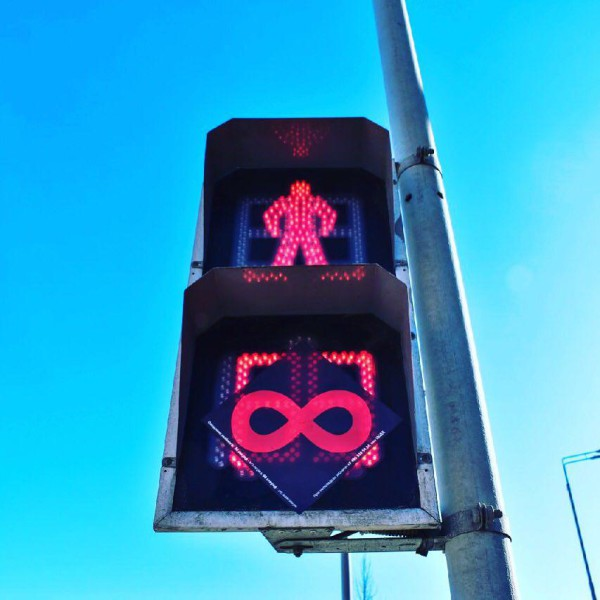
*Credits planeta.ru*

Partizaning tactics consist of unsanctioned repairs and improvements that collectively help recreate a better city. Some of this tactics are DIY benches, painting crosswalks and creating maps and signs that promote an alternative trajectories for the citizens, but also creating artefacts that change the condition of the living environments. These actions include:

**Park Making:** Increasing the supply of public park spaces by reclaiming under-utilized or vacant parking lots.

**Chair Bombing:** Improving the social well-being of neighbourhoods by salvaging discarded materials and creating something useful or comfortable, or necessary infrastructure in public space.

**Ad-Busting:** Reducing the visual pollution on billboards and ads within the public realm.

**Camping:** Temporarily occupying a space, often with an eye towards creating permanent change[^76].

Through their practice, Partizaning acknowledges that there are many local problems that cities authorities do not consider important., And, the collective acknowledges that the bureaucratic process for possibly attaining the recognition of these problems would take too long. As stated by Igor who quotes **"Right to the City"** by Lefebvre, inspiring the citizen through actions rather than only words and not only words, helps the citizen feeling that their city or neighbourhood belongs to them[^77]. Even by small actions that may not visible to mass media, a type of agency in the space is created.

[^76]:Lydon, Mike **[Tactical Urbanism for Urban Replanning](http://eng.partizaning.org/?p=1441)** Partizaning. Accessed December 5, 2018. .

[^77]:Lefebvre, Henri. 1991. **“The Production of Space”**. Oxford, OX, UK: Blackwell.

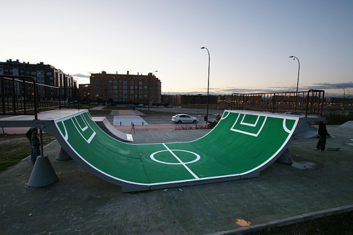
*Credits Partizaning*

Their approach resembles “arbitrary intrusions” as coined by Sennett. This is the idea that very simple interventions create value for places[^78]. For Sennett, this type of intervention could shape the path of development in cities of all sizes. Sennett has advocated for the investment in more of these. For example, the International Monetary Fund organised workshops for communities to co-create street furniture.

[^78]:Sennett, Richard. **“The Open City”** Harvard School of Design Talks, 17 Oct. 2017

The Partizaning tactics are predominantly executed in the streets and rarely indoors. This is in contrast to the contemporary practice of cities that showcase prospective architectural propositions in dedicated spaces and often in contemporary art museums, such as Garage (Moscow). Partizaning presents their work with communities in museums but also in the street. The collective is careful as they are aware that their art could be also exploited by art-backed by institutions and create what Brian O’Doherty calls “summer vacation photo effect[^79].”  Indeed, many of today’s depictions of urbanism in thematic exhibitions in museums are made by artists with “useful” ideas that were selected by art curators, critics and journalists to whom public opinion is important. Participation and opinion of the public is biased because they think that what is shown are visions of future urbanism projects, but instead they are adapted to fit in the canon of usefulness and a common good as determined by the cultural institutions. In a way,one can see this as a “mile of string” effect, to distract visitors and artists away from the real problems in urbanism (Duchamp)[^80].

[^79]:O’Doherty, Brian. Inside the White Cube: the Ideology of the Gallery Space. University of California Press, 2010

[^80]:Tate. “Duchamp, Childhood, Work and Play: The Vernissage for First Papers of Surrealism, New York, 1942 – Tate Papers.” Tate,*“While this web-like construction produced the succès de scandale that Breton and the surrealists had hoped for, Duchamp’s intervention must have surpassed their expectations, to the extent that it almost obliterated the view of some of their works, which were supposed to be the centre of attention.”*

As Partizaning’s actions are mostly short-term commitments, a concerns that arises from this type of urban planning they advocate, is the sustainability and the long term effects on a city. Following the open city vision of Richard Sennett, many of the actions that take place in vacant lots, street corners and parking lots are open-ended for creating value and generating modularity to public spaces in the city[^81].

[^81]:Modularity in that many different uses can be given to the space in a long term period.The public space is potentially a space where people can find a use in the multiple forms it could take.This invites people to come up with ideas to use this space in creative ways or political ones.

Tactical urbanism is use in place-making and change-making by reframing the potentials of places by local communities rather than from master plans that do not take into account the opinions of their users and neighbours. This is the situation of various cities of Russia, where neighbourhood-scale democracy seems to be a better option than the powerful class-type of democracy.

*Credits Partizaning*

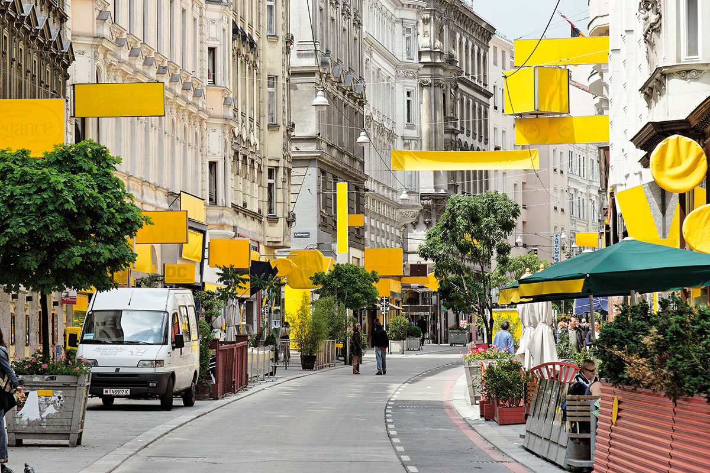
*Credits Partizaning*

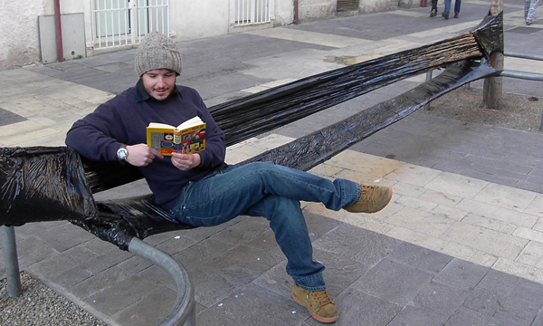
*Credits Partizaning*

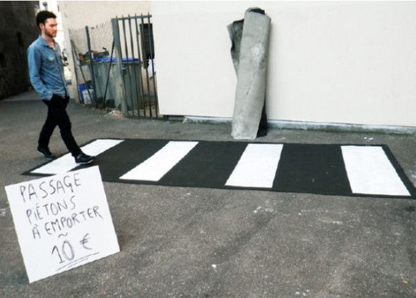
*Credits Florian Rivière*

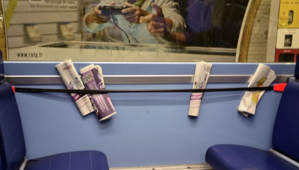
*Credits Fabrique | Hacktion*

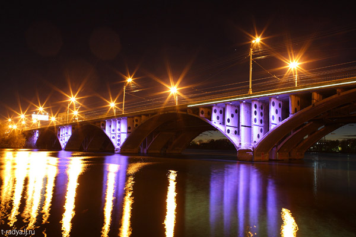
*Credits Tradya*

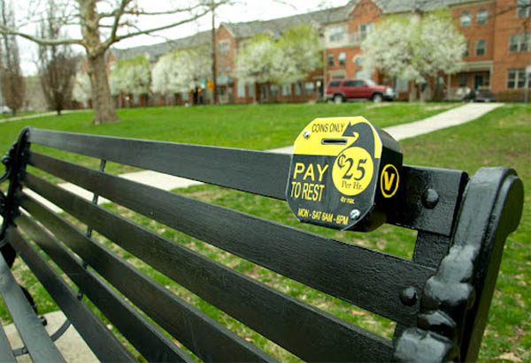
*Pay to Rest by Vinchen*

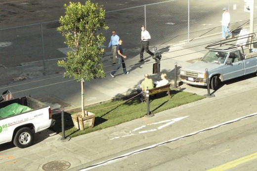
*PARK(ing) Day 2006 San Francisco*

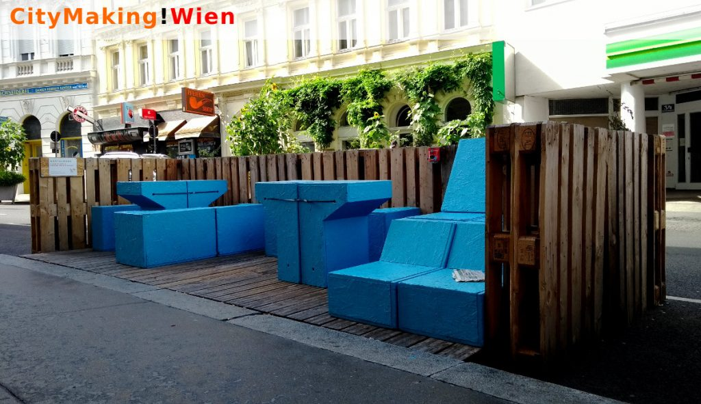
*City Making!Wien*

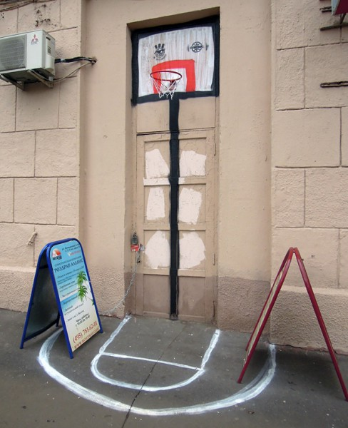
*Credits Partizaning*

# Hacking: a reciprocal form of interaction & Critical Making

In 2010 the term DIY citizenship and critical making was coined by Ratto and Boler, They articulate,
“to be a citizen is no longer merely about the standard political activities of voting, advocating for policy changes, and protest; citizen action is diverse, participatory, and discoverable in unexpected locales….DIY citizenship draws attention to nondiscursive activity and “direct action.”[^82]

[^82]:Ratto, Matt, and Megan Boler. **“DIY Citizenship: Critical Making and Social Media”**. The MIT Press, 2014.

Throughout their book, they explore these two terms in the context of social media. They consider where architects, planners and designers have started to develop ways to combine participatory methods with the advantages of social media technologies. Critical making comes from the DIY cultures where people share their knowledge on what they have learned from repairing or altering their daily artefacts. By doing this, there is a feeling of empowerment coming from one’s ability to change the hegemonic powers of the objects and structures around. Learning by doing, then, is a resourceful manner for mediating information as a hybrid of art and politics - art as doing something subjective combined with usefulness and beauty.

Contemporary architecture does not only cope with the material part of the infrastructure, but also mediates between the use of them. Even before Sennett’s open city, many other classical philosophers advocated for the importance of shaping the relationships between the objects around and their surroundings. This relationship could be explored through critical making workshops.
Initiatives such as the ones by Hackers & Designers[^83], Carlo Di Salvo[^84], and the The Bruit du Frigo[^85] have proven to be insightful for communities. Their non intimidating discourses and DIY ethos of low-tech creates a cheerful ambiance. These three examples are composed of designers as well by architects, sociologists, artists, and urban planners.

[^83]: **[“Hackers & Designers • H&D](hackersanddesigners.nl/)”**, 

[^84]: **[Carl Disalvo](http://carldisalvo.com/research/)**

[^85]:**[“Bruit Du Frigo“](http://www.bruitdufrigo.com/)**

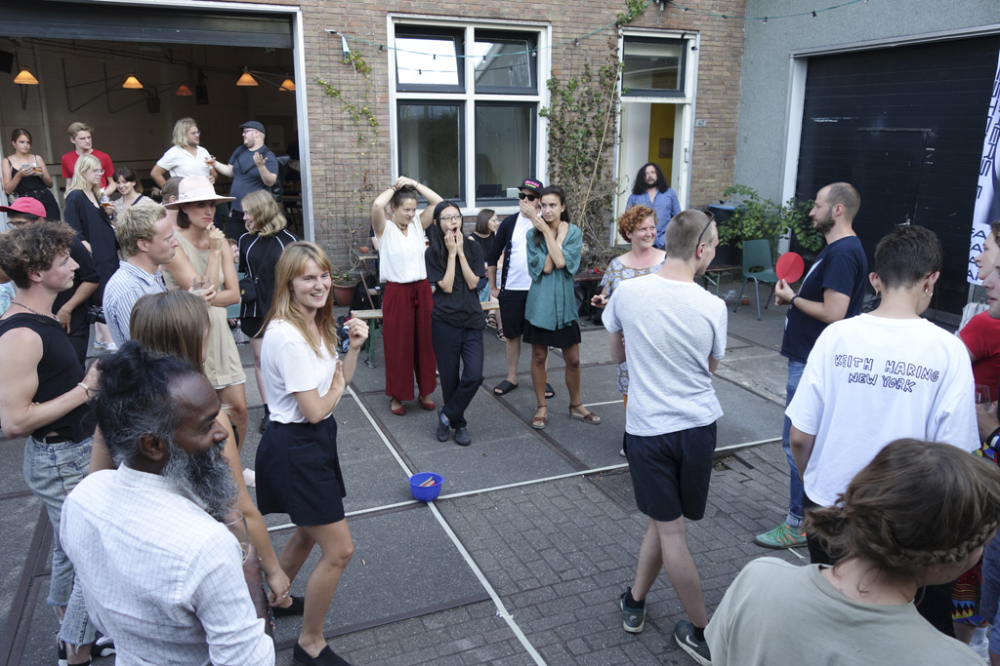
*Hackers & Designers 2018*

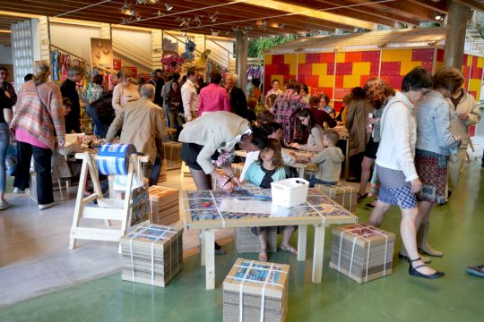
*Bruit du frigo, Le Visiteur Emballé, Octobre 2016*

Taking the concepts of public sphere from Habermas (rational critique) or from Sennett (spatial realm and the concept of the neighbor), we can consider critical making. In its social DIT manner, it creates discussions around objects in a fruitful way for getting to know the physical aspect of hybrid public spaces. As well, critical making could help stakeholders better understand how algorithmic environments used to communicate and exchange ideas (Facebook,Twitter, etc.) influence their discourse and interactions.

“If hacking is about understanding a system, appropriating it, and using it for alternate purposes, then the core of a truly successful hack in urban space involves, first, what the signs, discourses and ideologies are of the space; second, how the hack appropriates the space; and third, how the hack transforms the space to communicate another message to a broad public.”[^86]

[^86]:Ratti, Carlo. **"The City of Tomorrow Sensors, Networks, Hackers, and the Future of Urban Life"**. Yale University Press, 2016. “If hacking is about understanding a system, appropriating it, and using it for alternate purposes, then the core of a truly successful hack in urban space “involves, first, what the site means; second, how the hack appropriates the site; and third, how the hack transforms the site to communicate a message to a broad public.”Quote transformed.

I define activist as someone who is at the frontline of the problem and takes risks for their cause. The technosolutionist speech that companies and developers use to argue their urbanism requires a critical view for oppositions to take place. Designers that go out of their comfort zone are activists, as they are dealing with very complex issues that do involve creatives as well as politicians, communities, economists, sociologists and, more importantly, people who don't understand many of the technological threats and advantages of embedding technology in public infrastructure.

I stress that the role of the designer is different from the roles usually taken in social sciences and engineering. The designer can give a lot in the procedural process of co-creation. More than that, the designer can provide a type of knowledge that is given through design education, an education that, through forms of knowledge that are expressed in materials, volumes and shapes, could solve social problems as well as material  ones. A “designerly” way of knowledge.[^87]

[^87]:Nigel CROSS, 2006, **"Designerly Ways of Knowing"**. London: Springer Verlag

# Afterword
Sunday two of December I was in La Gaité Lyrique in Paris at a talk called “Growing networks and raising kittens.” This talk had as speakers Spideralex : Cyberfeminist, Benjamin Cadon, Claire Richard which whom I have heard before.
Other two non-french speaking speakers were invited and made me showcased some relevant projects for this thesis, to be more precise in DIY infrastructure.

Guifi.net presented by Clara Cuso is a bottom-up, citizenship-driven project that aims to create free, open and neutral telecommunication network. The project exists since 2004, and I find it an excellent example on governance models for projects of this kind to exist.

Nethood was presented by Panayotis Antoniadis,  a non-profit based in Zürich that helps people in the development of Do-It-Yourself tools and methodologies for empowering local actors to build networked localities that can support each other without suppressing their differences. I talk to him about my thesis project and found out that they had a research paper titled “The right(s) to the hybrid city and the role of DIY networking(2016)”.

This last minute finding gave me a lot of encouraging support to continue with the ideas I developed. I invite them to Geneva in March to see how I can join and learn from their experience in DIY infrastructure and what they call critical listening.

Their voice will be helpful for my final project as I intend for it to be the follow up of this thesis.

# Interviews

>Roger Paez i Blanch
Founder of the studio AiB
PhD cum laude (UPC)
Co-director of the MEATS

>Architect (ETSAB 1998); MS AAD (Columbia University 2000—GSAPP Honor Award for Excellence in Design); PhD (UPC  2015—summa cum laude).

>Following professional experience in the studios of Alison + Peter Smithson and Enric Miralles, he founded A i B estudi d’arquitectes, an award-winning studio devoted to contemporary architectural practice with a critical edge, based in Barcelona (www.aib.cat).

>He has published books and articles and has maintained an intense commitment to cultural, research and academic pursuits. He has taught and lectured on architectural design in various universities worldwide (e.g. ELISAVA, ETSALS, ETSAB, ETSAV, IaaC, BAC, UMA, Columbia, Cornell, Harvard, Sci-ARC, USC).

>28.11.2018

**Juan Gomez:** We spoke a lot last time about temporality and it’s the influence on participatory decision making in public space.

I’m already quite advanced of my thesis that you read and have some questions that I think you could answer accurately as you have the director of a master (Master on ephemeral architecture and temporary spaces in Elisava (Barcelona) but also have a practice as an urbanist.

There are two aspects we talked:
One was festivity as a way to create a sense of belonging to a place, and the other was the short time span that a “pop up” installation in relation to the use it has.

Something temporary but that in the long term has a more significant trajectory. How can short time create long-term impact? How can the short term be created as sustainability?
I would like your point of view on this.

**Roger Paez:** It seems to me a key issue in many ways and what you are talking about this can be raised from many points of view.

The question of temporality in space in the spatial project what I understand as architecture at all levels that goes well beyond conventional architecture seems to have an interest at multiple levels. The first is a question that we could call order epoch, which is the pre-eminence (at least in the first world). The pre-eminence of experience with respect to structure, the pre-eminence at the psychological level even, with regard to material belonging, there is more and more monetized economy that promises and that caters to the experience and not the object or the classic condition of material property assimilated to an object. A house, a car, more conventional status elements.

More and more the value is put in questions of experiential order. It can be seen very clearly in the economic importance of the world of tourism and in the type of trips that are considered beyond the mass tourism. Also that more and more products that are sold or are intended to be sold from the point of view of something that generates an experience, in this sense Coca-Cola was advanced in its time. There is a general sensibility of this epoch that makes that what was understood as “lacking” now valid. As opposed to say what is permanent in the classical model. That which is the structure that remains and therefore that articulates a civilization. The understanding of the temporal as that which is not permanent and therefore has no foundational value, 

On the contrary, it becomes more and more a kind of redoubt of experience and “lived life” as important. This is not only seen in design or architecture. The importance of what has been lived with respect to the conditions that allow you to live it.

This is the first point that makes the reflection on temporality be understood in terms of something minor or something lacking permanence or something that is not yet permanent, can be understood in a positive way. This is an important point of a general framework

Regarding our question is the city. Richard Sennett is very visible now, but he is one of the many who raised the issue that the city is not only the material structure but the organizational social structure. Even classical philosophy had already spoken in these terms. It means that it is not only the question of a material structure (buildings, streets) and other structural systems that allow for the organization of a common public space or private space, but that it is understood that characterizing in a certain way the city is precisely the relationships that are established between the objects and people that inhabit it and therefore the fact that the city is an inhabited environment is a verb. 
Again this preeminence of the verb with respect to the noun(name).

There is this interesting tension in the city between public space in a very clear way, between a fixed physical structure or with a certain degree of permanence, which has to be able to be enormously flexible in assuming uses and appropriations of very diverse order, some programmed and many of them not programmed. That is, generate a structured and therefore permanent environment (a subject, is able to host the verb). This is the crucial question of “inhabiting” and the “inhabitant”( Habitat and Habitar), by this constant they pass from the noun(name) to the verb, the house or that which makes something a house, that the gestures of inhabiting and in the end generate an inhabitant.

I believe that temporality is very important because it allows us to enter into a more immediate, more direct, less heavy horizon at all economic, logistical, legal and other levels, which therefore allows a degree of risk from the point of view design. It is also true they have drawbacks that is that as it is not typified when you go to a town hall with a proposal for a public space intervention they do not know precisely what it is or where they put it and through what administrative logic can be done.

**JG:** What you just said reminds me a bit of the interview I had with the Partizaning collective in Russia, they proposed many things to their municipality and none happened. They told them that they did not see any sense in installing something in the public space since they did not see big economic goals or see any reason for this temporary space to take place and that is why they made their interventions without asking much.

How could a temporary project of this short time exist?
How could there be participation by people in the conception of public space installation?
What factors would give light to a project like this?
Can the concept of community around something, a common goal, or a common idea of ​​a space help?

**RP:**  A quick comment, one of the issues by which one often encounters the difficulty of interlocution with the public administration regarding projects of this type is not so much that it is difficult for them to understand the value because this could be explained well, and it can be shown quite well, but there is a much more pragmatic issue and  that is that it is not typified since the ultra-bureaucratic logic of contemporaneity. Short term is a great advantage because it allows us a risk and an ability to mix skill sets and very different logics of work but at the same time has the difficulty that there is no capitulation on how to do it. For example, there is not a budget for this, then this projects need to be always taken from the budget of artistic interventions or maintenance of public space, but some of these interventions are not easy to classify for the bureaucratic system. The idea of ​​“curating public space,” which had a kind of budgetary entity, would surely allow unlocking many of these issues.

To go to the question, I am very much in agreement with what you say, and I think it is fundamental for what I said at the beginning for the epochal value of temporality and experience, to be able to understand the project positively and affirmatively temporary space. To make this a fundamental issue it is evident that sustainability plays a key role at three levels: economic, social and cultural. The dynamics are not purely playful animation systems as  brand strategist could use, but they are really a kind of “Curatorship of public space.” This is very well understood in the study of landscape, and this discipline interests me a lot because I think it is very close in our logic although it uses different temporalities.

Landscape architecture comes from the world of agronomy and gardening, and they work with long times, but precisely for that reason just as it happens to us with short times the accent of the design is not the result but the process that allows a result to happen. It does not mean that it is not controlled, but it is controlled in a much more “soft” way. In a more conventional architecture, it is much more direct the control of the result if the process serves to arrive at a result that is implemented directly. In ephemeral architecture or landscape architecture, in the first  for short times in the second for long times, time has to be incorporated in a radical way, so what is worked on above all is the design process that will generate results. Not results that you can control fully or want to control with the degree of precision that is managed in permanent architecture.

So in the case of gardening and landscape helps us a lot with this in this logic, for example how to understand that our design gesture today has to be something that is understood as valid today but within 100 years? Also already throughout all these 100 years. When you plant a tree you have to decide what effect this little one will have in the next five years, when the tree is between 10 and 20 and when it is an adult tree between 20 and 50 and when it is a monumental tree. There are very specific logic and techniques of traditional gardening that work in this sense, for example the idea of ​​associating the plantation of an oak with the plantation of a poplar. The poplar grows very fast and the oak very slow. As the poplar grows fast it gives shade to the oak, the oak grows slower but when the oak has grown the poplar can be cut. Management of times

**JG:** It’s like an ecology of gestures.

**RP:**  Exactly

The question of ecology is also crucial because it is the science of relationships; therefore, the relationships are variable in time, and this is what is critical to understand.

Sustainability is very important and not in the basic or banal sense that is normally given to the question of sustainability, but in the sense of the ability to generate impact in the short, medium and long-term impacts of a different order and to generate an effect.

That is to say to have an agency in the short, medium and long-term. The same is true for landscape architecture as for ephemeral architecture, that is when you are intervening a concrete public space, for example, with an event. It would be the most extreme case since it is very short and almost without physical infrastructure, but you are generating a temporary impact in short scale but you may be generating or trying to generate other medium and long-term impacts.

For example, we are now working in a specific public space near Barcelona that, after studying it very well, we understood that it has no problem beyond having a negative perception. Before it was a central space in which this neighborhood was physically or morphologically generated as a central square. The negative perception comes from issues of urban and sociological development and also from the fact that the people who lived there were considered humble and that it is now a less humble neighborhood.

The citizens have ended up associating this place with a humble origin that they do not like so much. The negative perception also has to do with the migration issue but that really is not a problem there at all. They are trying to make a physical change in the square , to reorganize and urbanize it.

We told them that this is very good but it costs a lot of money and this will improve the square and that by all means we have to do this, but we think it is very important that this physical “re-bumping” costs a few million euros. Preceded not only by a participatory process in the construction site but also by encouraging the appropriation of this square by those of the immediate neighbors and citizens. Generate some kind of action that helps people feel theirs this square, and this can be super basic actions and with a minimal design component, for example, organizing chocolate night once a month.

**JG:** This is what many call Place Making?

**RP:**  we call it Civic Place Making

In this case what we are doing, without having to give too many speeches at a conceptual level of what we are doing at the public level, we say “We invite you to take charge of the Christmas decoration of this square”. We as designers, in this case as planners, to be more precise or as ephemeral architects. What we propose is to generate a basic structure that allows this space to be free but obviously “curated and managed” because otherwise, things do not happen (laughs), but not directed in the classical sense. For what? To achieve an effect in which I can take a photo with others and spend a memorable moment but above all to establish this dynamic of co-creation and active participation. This means not the classical  consultative participation.  They participate actively not only in the design of the square but (and I will use this word voluntarily) the “decoration,” a very modest thing, apparently very banal, with little conceptual charge.

In addition to this we are also proposing “plaça in calcetines” the idea is to domesticate the square, turn it into something domestic. You walk in your house in socks and to the square also in socks. The sock is also a Christmas element and has been customized by children in school and the elderly in their homes. Hanging their own socks that have been personalized next to all the other socks  in the square is telling in a clear way that many people are appropriating this square. And then this is the excuse to make visible the bottom line that is to make people converge again to the square and turn it into a space of sociality.

In this particular case, which is not very large at the level of gestures, what we are trying to do is to achieve on the one hand that in the short timescale there is a visibility, for example in the newspaper, but also to make visible a process and  intention of making a co-creation between some designers and architects with a public administration and with the citizens organized through their neighborhood organizations.
"][p-0o98"

Three things come from this example:

In the short term it is simple and cheap to do

In the medium term, the idea would be that having contributed the specific infrastructure, in this case, very basic exterior lights that are reconfigurable, they are encouraged to use them creatively in the other Christmas no longer with specialists but directly with the people of the neighborhood. We facilitate a little, but ideally, they do it themselves.

In the long term ideally what this would have to allow is to make a place where memories have already been generated, people’s experiences having a good time and sharing space in a humanely productive way not only intellectually but vitally so they feel good in that space therefore they will care for it much more in every way. This is a super simple example, but there are many other very interesting ones.

It seems very interesting to me, and it seems to me that there are other formats in which we can work. The one I just told you could be summarized by saying: Through ephemeral design one can change the perception of a place.

I like many of the examples that you raised, for example, the bridge(Luchtsingel) with co-financing and Partizaning although I do not know them. Similar to Partizaning there is Raum Labor that they were doing with this type of actions in Berlin in the late and early 90’s that are much more direct than our methods.

Another framework of work for me could be: Use temporary architecture as a testing ground for a permanent architecture and be able to use cheaper affordable mechanisms, feasible both economically and at an organizational level as well as at the level of involving citizens than a conventional project.

Thinking of a space that at this moment does not work very well and to propose some logic of temporary intervention that allows to point directions that can get to consolidate in a permanent intervention and this is not a project that begins and ends when the intervention is made, since then one has to be able to record the effect that this intervention is having or will have. For example regarding the flows of the square, or how it is organized or how it is perceived, etc. So to speak, the test field

**JG:** I find interesting what you propose because in my thesis I relate technology and electronics embedded in the public space.
In my thesis, there is a part where I talk about this giving some examples in cities of the United States, where planners propose a great use of data extraction in an unethical way.
It would be interesting in these dynamics of short temporality and civic placemaking to generate a speculative discourse.
That is, to show one of the paths that the conception of these spaces could take. A participatory and speculative mediation.

How ephemeral space can speculatively show what a long-term space would look like?

**RP:**  Changing the perception of public space should have the logic of sustainability and one of the test field. For me, it is not so much the use of temporality as a permanent model, but precisely because of its very nature, temporality allows us a much greater risk and this allows generating a higher field of evidence. It is not so much as you said to educate or to tell a resolution but to pose a significant problem. For example, the issue of surveillance that you are aiming for. In that sense, we are again in a participatory logic of citizenship that is not consultative but is co-creative. For me this is important.

I think it would be a third exciting element to consider what kind of formats can take the ephemeral architecture of temporary design in public space. What variety of formats can be co-created that do not exist directly nowadays? In this case, technology plays a fundamental role, for example outside the Apple Stores in Barcelona there is free WIFI. These spaces have become a meeting place for a type of population that for economic reasons does not have access to broadband and appropriates this space in a rather picturesque way, simply because there is a service that did not exist before. New formats of public space generated from logics of technological services and experiences that use technology can be imagined.

> Igor Ponosov 

>1980 
Nizhnevartovsk (Russia) 
Lives and works in Moscow. 

>Russian artist, ‘Partizaning’ activist, curator and researcher focused on Urban Art. Author of books: ‘Art and the city’ (Искусство и город) and ‘Russian Urban Art: History and Conflicts’. Laureate of The Sergey Kuryokhin Contemporary Art Award (St Petersburg). 

>Between 2005 and 2009 he published three books on street art in Russia and the ex-USSR. From 2011 to 2013 he curated The Wall a project based in the CCA ‘Winzavod’, Moscow. In 2011 he founded the Partizaning.org website as a platform for exchange among activists, artists and urbanists. From 2013 to 2016 he curated Delai Sam festival, which focused on grassroots iniatives and activism in Russia. Igor is author of the book Art and the city (2016), for which he received The Sergey Kuryokhin Contemporary Art Award 2016 for Best Text on Contemporary Art (St. Petersburg). In 2018 Igor has been published ‘Russian Urban Art: History and Conflicts’ book, which has been launched in Tartu (Estonia), Besancon (France) and Paris.

>19.11.2018

**Juan Gomez:** Could you tell me more about your background? I remember the we met in Moscow you told me you were an computer engineer for some time of your life. Is that right?

**Igor Ponosov:** My background is IT, but same time I started to do graffiti in 2000. later I just combined the practices in my life, I mean, it was kind of double life: full time working in the office with making graffiti/street art in the night. Partizaning changed my life, now I have no job in the office.

**JG:**  How did Partizaning started and what are the “sister” projects that came out of this initiative?

**IP:** In 2010-2011 we felt bad in Moscow, the city was car orientired city (it is still). We had no cars and we love walking and biking.We tried to make our own infrustructure for that. we did some urban interventions, kind of “improvements”: benches, crosswalks, bikelines. We wanted to show our ‘right to the city’. At the same time we tried to involve citizens, making self-organizing process somehow. That time was political collapse, in Russia big protest movement was held, our Partizaning movement was an alternative of bipolar choice (Putin or Navalny).
We worked as political activists, but different (more anarchistic) way somehow.

**JG:**  As you have worked in cities in Russia,Europe and South America:What do you think is the biggest critique that DIY practices of urbanism have these days in this 3 difference contexts?

**IP:** DIY is trendy now, but more natural for us is working in Moscow, where we are living, also DIY is very related to Russian culture, it was born in Soviet timse, when it was very hard to find something, it was time of deficite plus an ultra-burocratic system that made that if you wanted something in Soviet time, you just needed to do it yourself.

**JG:**  “Appropriating” urban space for unintended uses does not in itself give birth to a new kind of city instantly and is a tactic within others media tactics that should take place to achieve a bigger goal.
How do you think is the other “Media Tactics” that should go along with the more material ones( paint, reinterpret, etc)

**IP:**  Partizaning actions have  worked for changing the city
(Moscow).
Moscow changed a lot, we have bike lines and better city center for walking, some public spaces have expanded. Now the question is the quality of public space, it’s going better, but still is not natural, I feel it has grown because of money and is kind of kind of artificial. There are big changes but looks like temporary ones, just like a decorations.

**JG:**  What do you think of temporality and how do you thing that this temporal interventions in urban space help shape a better city?

**IP:**  I think so. It’s more about actions which are get attention by the government, which react by positive or negative way. In Moscow it’s more about positive reaction, but I think, it’s just a politic, strategy which have a goal suppression of protest movement.

**JG:**  My research deals with the possibility of creating a hybrid public space that can connect people in different cities. Is like trying to materialise in an architectural project what a connected public space would look like. How important do you think temporality is in this sense?

**IP:**  Maybe it’s not so important, depends of urban context, where you want to make it, I guess. Anyway, you need to make a good research about communities there before.

**JG:**  In your experience that is the biggest difficulties in documenting projects like this and “hoping” for them to be reproduced and appropriated in other contexts?

**IP:**  We didn’t do any documentation, because it was more important to involve  national media. They did videos or pictures and many times we got fun from publications our interventions. It was more interesting for us to have an interpretation of our interventions, some times it was new meaning and more related to the context.

**JG:**  Social media seems to be crucial for sharing tactics and methodologies from others. How do you foreseen the future of this social technologies that are not so public and this days?

**IP:** Can’t think about future, I wish to change the  world from smart to stupid now, sorry :-)

I mean, it’s quite hard to think about technologies now, it’s very fast going, I’m trying to be slow, to have a concentration.

**JG:**  What do you think of “smart “city as a term? What role should technology have for creating smart cities or to generate collective knowledge for a city?

**IP:**  I prefer stupid city, too much smart around me now.

